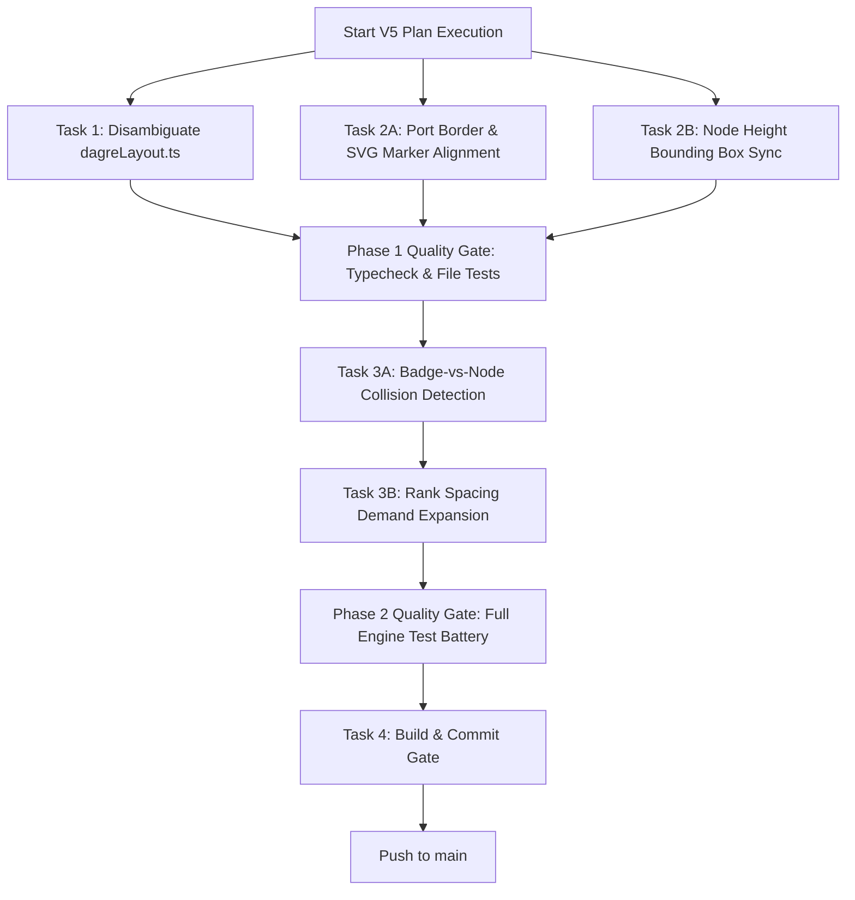

# Deployment & Implementation Optimization Agent Specification

## Role & Architecture

The **Deployment & Implementation Optimization Agent** orchestrates task execution across parallel and sequential worker agents. It analyzes task dependencies, groups independent work streams, enforces quality gates between phases, and guarantees clean integration before branch completion.

---

## Task Parallelization & Dependency Matrix

### Task Classification

| Task ID | Task Description | Dependencies | Mode | Subagent Assignment |
| :--- | :--- | :--- | :--- | :--- |
| **Task 1** | Legacy File & Naming Refactoring (`dagreLayout.ts` $\rightarrow$ `nodeDimensions.ts`) | None | **PARALLEL** | Subagent A |
| **Task 2A**| Port Border Attachment & SVG Marker Alignment | None | **PARALLEL** | Subagent B |
| **Task 2B**| Node Height & Bounding Box Synchronization | None | **PARALLEL** | Subagent C |
| **Task 3A**| Badge-vs-Node Overlap Detection in `labelLanePlanner.ts` | Tasks 2A, 2B | **SEQUENTIAL** | Subagent D |
| **Task 3B**| Rank `nodeGap` Spacing Demand Application in `layoutOptimizerState.ts` | Task 3A | **SEQUENTIAL** | Subagent E |
| **Task 4** | End-to-End Acceptance & Strict Validator Verification | Tasks 1–3B | **SEQUENTIAL (GATE)** | Evaluation Gate |

---

## Execution Workflow & Quality Control Gates



---

## Automated Verification Protocols

At each quality gate, the Deployment Agent executes the following validation pipeline:

1. **Per-Task Unit Tests**:
   ```bash
   bun test src/engine/layout/nodeDimensions.test.ts
   bun test src/engine/layout/custom/labelLanePlanner.test.ts
   ```

2. **Full Engine & Scenario Acceptance Gate**:
   ```bash
   bun test src/engine/layout/custom/customLayoutAestheticAcceptance.test.ts
   bun test src/engine/layout/custom/customLayoutValidatorStrict.test.ts
   ```

3. **Type & Lint Enforcement**:
   ```bash
   bun run typecheck
   bun run lint
   ```

4. **Production Build Gate**:
   ```bash
   bun run build:local
   ```

No branch or commit is finalized until all 4 verification protocols return exit code 0.
