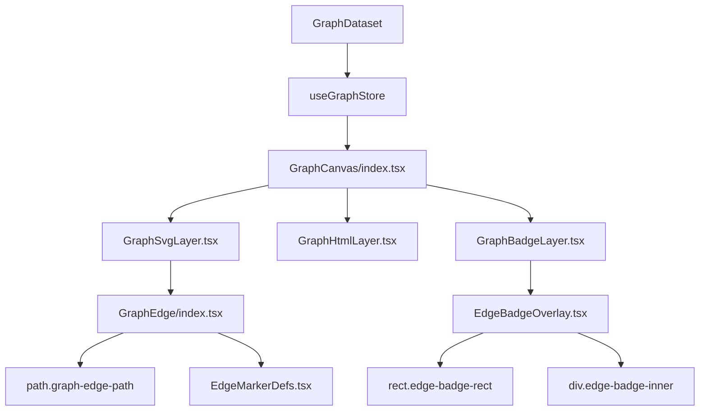

# Module 1 Specification: Edge Color Harmonization & Centered Typography

**Document ID**: `GVUI-SPEC-2026-08-15-EDGE-STYLING`  
**Status**: `PROPOSED / APPROVED ARCHITECTURE`  
**Target Path**: `gvui/src/primitives/edges/GraphEdge/`, `gvui/src/engine/GraphCanvas/`  
**Author**: Dedicated Planning Director  
**Date**: 2026-08-15

---

## 1. Executive Overview & Problem Statement

In the GVUI execution graph visualizer, edges model causal, sequence, data handoff, and feedback relationships between orchestration nodes. While nodes are visually categorized by clear semantic archetype accent colors (e.g. Violet for Input/Prompt, Blue for Coordinator, Cyan for Worker, Green for Gate, Indigo for Critic), edge strokes and edge badges currently suffer from three distinct visual and interaction defects:

1. **Source Node Color Disconnect**: Edge strokes default to either hardcoded semantic color palettes (`.kind-spawn`, `.kind-data`, etc.) or fallback neutral zinc (`#3f3f46`), ignoring the originating source node's theme or runtime accent. This breaks visual continuity when tracking outbound workflows from specialized nodes.
2. **Missing Edge Selection Synchronization**: Clicking an edge path or edge badge does not trigger node selection or edge drawer synchronization. In `GraphSvgLayer.tsx` and `GraphBadgeLayer.tsx`, click handlers are omitted or not forwarded to the global store (`setSelectedNodeId` / `setSelectedEdgeId`).
3. **Redundant "CYCLE" Prefixing & Label Clutter**: Feedback loops and pushback edges currently prepend `"CYCLE ("` and `")"` to edge badge titles in `EdgeBadgeOverlay.tsx` (e.g. `CYCLE (Repair Task #2)` or `"CYCLE"`), creating visual noise, redundant prefixes, and excessive badge widths.
4. **Off-Center Badge Typography & Gap Asymmetry**: Edge badge containers in `EdgeBadgeOverlay.tsx` and `GraphEdge.css` suffer from right-side whitespace inflation due to conservative font metric estimations and missing `text-anchor: middle` / strict flexbox alignment when bounding boxes (`badgeRect`) are allocated by the layout engine.

This specification details the mathematical models, component contracts, CSS token architecture, and deterministic implementation roadmap to achieve complete edge color harmonization, bidirectional selection synchronization, clean raw cycle text rendering, and pixel-perfect centered typography.

---

## 2. Architectural Analysis of Existing System

### 2.1 Component Flow & Touchpoints



### 2.2 Root Cause Analysis

#### A. Source Node Accent Disconnection

In `GraphSvgLayer.tsx`, the SVG element only injects `--accent-color` based on the currently selected node (`selectedNodeAccent`):

```tsx
const edgeStyle: CSSProperties | undefined = selectedNodeAccent
  ? ({ "--accent-color": selectedNodeAccent } as CSSProperties)
  : undefined;
```

Each individual `<GraphEdge>` does not receive the accent color of its specific `edge.source` node. As a result, non-selected edges fall back to static CSS class rules based solely on `edge.kind`.

#### B. Click Event Severance

In `GraphSvgLayer.tsx`:

```tsx
<GraphEdge edge={edge} isSelected={isEdgeSelected} renderBadge={false} />
```

`onClick` is undefined. In `GraphBadgeLayer.tsx`:

```tsx
<EdgeBadgeOverlay ... onClick={/* omitted */}/>
```

Clicks on SVG paths or badges never reach `useGraphStore.getState().setSelectedNodeId` or `setSelectedEdgeId`.

#### C. Redundant "CYCLE" Label Prepending

In `EdgeBadgeOverlay.tsx`:

```tsx
const displayText = isCycle
  ? titleText?.trim()
    ? `CYCLE (${titleText})`
    : "CYCLE"
  : (titleText ?? descriptor.label);
```

This forces unnecessary string manipulation that pollutes the badge label with uppercase `"CYCLE"` banners when the red/crimson stroke and reverse dashed animation already convey cycle semantics.

#### D. Badge Width & Text Centering Gaps

In `EdgeBadgeOverlay.tsx`:

```tsx
const computedWidth = Math.max(
  54,
  (effectiveStep ? effectiveStep.length * 7 + 14 : 0) +
    displayText.length * 6.8 +
    (detailText ? detailText.length * 6.0 + 10 : 0) +
    (bundleSnippet ? bundleSnippet.length * 6.2 + 12 : 0) +
    20,
);
```

When `badgeRect.width` is computed by the WASM layout engine (e.g. 140px) but the rendered text is only 60px, flexbox layout inside `<foreignObject>` must strictly guarantee centering without left/right text bias or descending glyph clipping.

---

## 3. Detailed Architectural Design & Solutions

### 3.1 Source Node Accent Propagation Model

We establish a deterministic color inheritance protocol:

1. **Source Node Lookup**: During `GraphCanvas` rendering, create a fast lookup map `nodeAccentMap: Map<string, string>` where `nodeAccentMap.set(node.id, describeNodeKind(node).accent)`.
2. **Propagated Color Property**: Pass `sourceAccentColor={nodeAccentMap.get(edge.source)}` into `<GraphEdge>` and `<EdgeBadgeOverlay>`.
3. **CSS Variable Binding**: Apply `style={{ "--edge-source-accent": sourceAccentColor }}` to each `<g className="graph-edge-group">` and `<g className="edge-badge-group">`.
4. **Dynamic Stroke Fallback Hierarchy**:
   $$ \text{StrokeColor}(e) = \begin{cases}
   \text{var(--accent-color)} & \text{if } e \text{ is selected/highlighted} \\
   \text{edge.traffic.glowColor} & \text{if } e \text{ has explicit traffic color} \\
   \text{var(--edge-source-accent)} & \text{if } \text{propagateSourceColor is enabled} \\
   \text{Descriptor.stroke} & \text{default fallback by } e\text{.kind}
   \end{cases}$$
   $$

```css
/* GraphEdge.css Enhancement */
.graph-edge-group {
  --current-edge-stroke: var(--edge-source-accent, var(--edge-kind-stroke, #3f3f46));
}

.graph-edge-path {
  stroke: var(--current-edge-stroke);
}
```

### 3.2 Bidirectional Edge-Node Selection Synchronization

When a user clicks on an edge path or its badge:

1. **Primary Selection**: The edge itself is marked as selected (`selectedEdgeId = edge.id`).
2. **Source/Target Node Sync**: The drawer or canvas highlights the source node as the primary actor (`selectedNodeId = edge.source`) while retaining the target node as connected peer.
3. **Edge Detail Drawer Trigger**: If `EdgeDetailDrawer` is active, it opens with the complete provenance and traffic exchange payload of `edge.id`.

```typescript
// Selection callback in GraphCanvas / GraphSvgLayer / GraphBadgeLayer
const handleEdgeClick = useCallback((edgeId: string, sourceId: string, targetId: string) => {
  useGraphStore.setState({
    selectedEdgeId: edgeId,
    selectedNodeId: sourceId, // Sync focus to the source producer
  });
}, []);
```

### 3.3 Cycle Label Sanitization

Purge all synthetic string wrapping for cycles in `EdgeBadgeOverlay.tsx`:

```typescript
// Before:
// const displayText = isCycle ? (titleText?.trim() ? `CYCLE (${titleText})` : "CYCLE") : (titleText ?? descriptor.label);

// After (Direct Clean Rendering):
export function resolveEdgeDisplayText(
  titleText: string | undefined,
  descriptorLabel: string,
  isCycle: boolean,
): string {
  if (titleText && titleText.trim().length > 0) {
    // Strip any legacy embedded "CYCLE:" or "CYCLE (...)" if present in raw string
    return titleText
      .replace(/^CYCLE\s*[:\(-]?\s*/i, "")
      .replace(/\)$/, "")
      .trim();
  }
  return isCycle ? "Feedback Loop" : descriptorLabel;
}
```

### 3.4 Badge Color Harmonization with Edge Stroke

The badge rectangle border and background tint must match the edge stroke color:

- **Badge Border**: `stroke: var(--current-edge-stroke, rgba(255, 255, 255, 0.15))`
- **Badge Background**: `fill: color-mix(in srgb, var(--current-edge-stroke, #0d0d10) 12%, #0d0d10 88%)`
- **Glow Styling**: Synchronized drop shadow using `drop-shadow(0 0 6px var(--current-edge-stroke))` on hover or selection.

### 3.5 Center-Aligned Edge Typography

To eliminate empty right-side gaps and text offset artifacts:

1. `<foreignObject>` contains `display: flex; align-items: center; justify-content: center; width: 100%; height: 100%;`.
2. `.edge-badge-inner` utilizes `justify-content: center; text-align: center; margin: 0 auto;`.
3. Typography uses `letter-spacing: 0.02em; line-height: 1;`.
4. Pure SVG fallback text (if used) specifies `text-anchor="middle"` and `dominant-baseline="central"`.

```css
/* EdgeBadgeOverlay.css / GraphEdge.css */
.edge-badge-inner {
  display: flex;
  align-items: center;
  justify-content: center;
  width: 100%;
  height: 100%;
  padding: 0 8px;
  box-sizing: border-box;
  text-align: center;
  font-family: var(--font-mono, "JetBrains Mono", ui-monospace, monospace);
  font-size: 10.5px;
  font-weight: 600;
  color: var(--edge-text-color, #f4f4f5);
}

.edge-badge-label {
  display: inline-block;
  text-align: center;
  white-space: nowrap;
  overflow: hidden;
  text-overflow: ellipsis;
  max-width: 100%;
}
```

---

## 4. Comprehensive File Modification Specifications

### File 1: `gvui/src/primitives/edges/GraphEdge/edgeKinds.tsx`

- Ensure all 7 `SemanticEdgeKind` descriptors provide harmonized accent colors matching node counterparts:
  - `spawn`: `#06b6d4` (Cyan)
  - `sequence`: `#71717a` (Neutral Zinc)
  - `data`: `#6366f1` (Indigo)
  - `dependency`: `#64748b` (Slate)
  - `loop`: `#f43f5e` (Crimson Rose)
  - `gate`: `#10b981` (Emerald Green)
  - `critic`: `#eab308` (Gold)

### File 2: `gvui/src/primitives/edges/GraphEdge/EdgeBadgeOverlay.tsx`

- Remove `"CYCLE ("` wrapper strings.
- Add `sourceAccentColor?: string` prop.
- Inject dynamic border/background styles referencing `sourceAccentColor`.
- Ensure center alignment flexbox styling.

### File 3: `gvui/src/primitives/edges/GraphEdge/GraphEdge.css`

- Introduce `--edge-source-accent` and `--current-edge-stroke` CSS variable cascading.
- Apply transition on stroke color and width changes.

### File 4: `gvui/src/engine/GraphCanvas/GraphSvgLayer.tsx` & `GraphBadgeLayer.tsx`

- Compute `nodeAccentMap` and pass `sourceAccentColor` to child edges.
- Pass `onClick` callback to trigger `setSelectedNodeId(edge.source)`.

---

## 5. Verification & Test Plan

1. **Unit Test Suite (`EdgeBadgeOverlay.test.tsx`)**:
   - Assert `resolveEdgeDisplayText` removes `CYCLE` prefixes.
   - Assert badge renders with centered flex styling.
   - Assert source node accent color propagates to badge border styles.
2. **Integration Test Suite (`GraphCanvasIntegration.test.tsx`)**:
   - Assert clicking an edge fires `setSelectedNodeId` with the edge's source ID.
   - Assert edge stroke color matches the source node's kind accent.
3. **Visual Regression Gate**:
   - Run Playwright visual audit across all edge types to ensure 0 text clipping and centered badge alignment.

---
