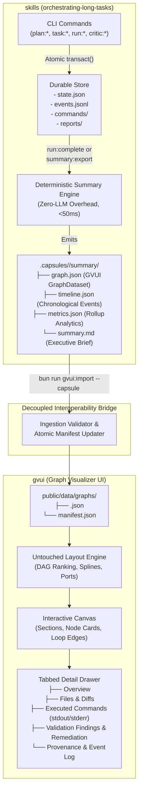
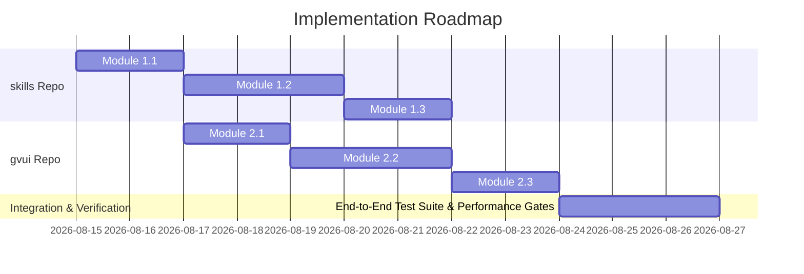

# Capsule Execution Summary & GVUI Visualizer Integration Specification

**Status**: Published Architecture Specification & Execution Plan  
**Date**: 2026-08-14  
**Author**: Antigravity Architecture & Tooling Team  
**Workspaces**: `skills` (`orchestrating-long-tasks`) & `gvui` (`graph-visualizer-ui`)  
**Target Capsule Schema Version**: 1.0.0 | **GVUI Schema Version**: 2.0.0

---

## 1. Executive Summary & Vision

As the **`orchestrating-long-tasks`** harness executes complex multi-step tasks across agent hierarchies (Tier 1 Chat Coordinator $\to$ Tier 2 Execution Planner $\to$ Tier 3 Implementation Workers, Independent Validators, and Completeness Critics), understanding the complete execution trajectory—actions taken, subagents dispatched, commands executed, feedback loops, validator rejections, and write scope diffs—is paramount for developer observability, verification, and debugging.

This specification establishes a deterministic, decoupled bridge between **`orchestrating-long-tasks`** and **`GVUI`** (Graph Visualizer UI) to provide automatic, interactive visual graph analytics for every agentic run without adding runtime LLM overhead.



### Core Architectural Invariants

1. **Zero LLM Runtime Overhead**: The execution timeline and summary are **never** written or summarized by a language model at runtime. All artifacts are derived 100% deterministically from `events.jsonl`, `state.json`, `commands/`, and `reports/` via pure TypeScript AST/JSON transformations in $< 50\text{ms}$.
2. **Preserve GVUI Pathfinding & Layout Engine**: All existing DAG ranking, port calculation, waypoint routing, and spline pathfinding algorithms in `gvui/src/engine/layout/` remain strictly untouched. Enhancements are strictly additive (sections/clusters, rich node cards, edge badges, tabbed detail drawer).
3. **Strictly Typed Taxonomy with Extensible Metadata**: Core graph elements (IDs, kinds, statuses, timestamps, metrics, ports) are strictly typed with zero `any` or `@ts-ignore`. Domain-specific details (git diffs, stdout/stderr streams, validator pushback findings) reside in typed metadata slots.
4. **Decoupled Standalone Interoperability**: `orchestrating-long-tasks` operates completely standalone with zero dependencies on GVUI. GVUI operates as an optional consumer capable of loading static graph JSON files or subscribing to live updates.

---

## 2. Module 1: Deterministic Capsule Summary Engine in `skills`

### 2.1 Capsule Directory Structure

Upon run finalization (or via the `summary:export` CLI command), the engine writes a canonical summary suite under `.capsules/<run-id>/summary/`:

```
.capsules/<run-id>/
├── manifest.json                  # Capsule manifest (run metadata, assurance, bun version)
├── prompt.md                      # Verbatim user prompt / execution instruction
├── state.json                     # Latest state projection snapshot
├── events.jsonl                   # Append-only hash-chained event stream
├── evidence/                      # Durable gate execution proofs and snapshots
├── findings/                      # Validator finding records
├── reports/                       # Task submission reports & review briefs
├── commands/                      # Durable stdout/stderr logs and activity records
└── summary/                       # DETERMINISTIC SUMMARY ARTIFACTS
    ├── graph.json                 # GVUI-compliant GraphDataset JSON
    ├── timeline.json              # Chronological event sequence with ISO timestamps
    ├── metrics.json               # Aggregated run-level & task-level metrics
    └── summary.md                 # Markdown executive brief formatted for humans
```

---

### 2.2 Comprehensive Event-to-Graph Translation Table (18 CLI Commands)

The summary engine processes the event stream (`events.jsonl`) and state projection (`state.json`) deterministically. The table below specifies the mapping for all 18 CLI commands:

| #      | CLI Command                              | Store Event Kind                   | Generated Graph Node(s)                         | Generated Graph Edge(s)                                                     | Node Kind & Status                                                       | Detail Drawer Data Captured                                                        |
| :----- | :--------------------------------------- | :--------------------------------- | :---------------------------------------------- | :-------------------------------------------------------------------------- | :----------------------------------------------------------------------- | :--------------------------------------------------------------------------------- |
| **1**  | `plan:init`                              | _Initial capsule creation_         | `node-input-prompt`                             | None                                                                        | `kind: "input"`<br>`status: "success"`                                   | Verbatim prompt text, prompt SHA-256, capture assurance mode, working directory.   |
| **2**  | `plan:add`                               | `plan-task-added`                  | _Staged task definition_                        | None                                                                        | _Internal buffer_                                                        | Goal, criteria, write scopes, priority, estimated effort.                          |
| **3**  | `plan:compile`                           | `plan-compiled`                    | `node-orchestrator-plan`                        | `node-input-prompt` $\to$ `node-orchestrator-plan` (`kind: "sequence"`)     | `kind: "orchestrator"`<br>`status: "success"`                            | Graph revision, total tasks, wave concurrency structure, topological order.        |
| **4**  | `plan:status`                            | _(Read-only)_                      | None                                            | None                                                                        | None                                                                     | Query only; does not alter graph projection.                                       |
| **5**  | `queue:next`                             | _(Read-only)_                      | None                                            | None                                                                        | None                                                                     | Query only; returns highest-priority ready task.                                   |
| **6**  | `queue:list`                             | _(Read-only)_                      | None                                            | None                                                                        | None                                                                     | Query only; inspects queue partitions.                                             |
| **7**  | `queue:pop`                              | `task-claimed`                     | `node-task-${taskId}`                           | `node-orchestrator-plan` $\to$ `node-task-${taskId}` (`kind: "spawn"`)      | `kind: "agent"`<br>`status: "running"`                                   | Worker agent ID, lease token, lease duration, assigned write scopes.               |
| **8**  | `task:claim`                             | `task-claimed`                     | `node-task-${taskId}`                           | `node-orchestrator-plan` $\to$ `node-task-${taskId}` (`kind: "spawn"`)      | `kind: "agent"`<br>`status: "running"`                                   | Direct lease assignment, worker role (`implementer` / `repairer`).                 |
| **9**  | `task:heartbeat`                         | `task-heartbeat`                   | None (Updates `node-task-${taskId}`)            | None                                                                        | `status: "running"`                                                      | Extends lease deadline, updates last heartbeat timestamp.                          |
| **10** | `task:submit`                            | `task-submitted`                   | None (Updates `node-task-${taskId}`)            | None                                                                        | `status: "pending"` (awaiting validation)                                | Changed files list, diff line counts, submission summary, evidence reports.        |
| **11** | `task:validate-start`                    | `task-validation-started`          | `node-gate-${taskId}`                           | `node-task-${taskId}` $\to$ `node-gate-${taskId}` (`kind: "sequence"`)      | `kind: "gate"`<br>`status: "running"`                                    | Validator agent ID, validation lease token, mandatory gates to execute.            |
| **12** | `task:review` _(pass)_                   | `review-recorded`, `task-finished` | Updates `node-gate-${taskId}`                   | `node-gate-${taskId}` $\to$ Downstream Tasks (`kind: "sequence"`)           | `node-gate`: `"success"`<br>`node-task`: `"success"`                     | Review verdict, passing gate command IDs, unblocked downstream task list.          |
| **13** | `task:review` _(reject)_ / `task:reject` | `review-recorded`                  | Updates `node-gate-${taskId}`                   | `node-gate-${taskId}` $\to$ `node-task-${taskId}` (`kind: "loop"`)          | `node-gate`: `"error"`<br>`node-task`: `"warning"` (`changes_requested`) | Finding titles, severity, remediation instructions, repair round increment ($+1$). |
| **14** | `run:exec`                               | `command-recorded`                 | `node-cmd-${commandId}` (or embedded in parent) | `node-task/gate` $\to$ `node-cmd` (`kind: "data"`)                          | `kind: "tool"`<br>`status: exit_code === 0 ? "success" : "error"`        | Command argv, exit code, stdout/stderr logs, durationMs, trusted host binding.     |
| **15** | `run:status`                             | _(Read-only)_                      | None                                            | None                                                                        | None                                                                     | Progress summary across all task states.                                           |
| **16** | `critic:start`                           | `critic-started`                   | `node-critic-authority`                         | All Completed Task Gates $\to$ `node-critic-authority` (`kind: "join"`)     | `kind: "gate"`<br>`status: "running"`                                    | Critic agent ID, authority check scope, repository integrity checks.               |
| **17** | `critic:review`                          | `critic-reviewed`                  | Updates `node-critic-authority`                 | `node-critic-authority` $\to$ `node-terminal-complete` (`kind: "sequence"`) | `status: "success"` (if clean)                                           | Critic verdict, residual risks assessment, proof of completeness.                  |
| **18** | `run:complete`                           | `run-completed`                    | `node-terminal-complete`                        | None                                                                        | `kind: "terminal"`<br>`status: "success"`                                | Final capsule hash, total execution wall clock, cumulative token counts.           |

---

### 2.3 Rollup Metrics Calculation Algorithms

The summary engine computes exact analytics across multiple operational dimensions:

1. **Wall Duration & Active Compute Time**:
   $$\text{Wall Duration} = T_{\text{run:complete}} - T_{\text{plan:init}}$$
   $$\text{Active Execution Time} = \sum_{c \in \text{Commands}} (c.\text{finished\_at} - c.\text{started\_at})$$
2. **Deterministic Token Consumption Estimation**:
   $$\text{Estimated Tokens}_{\text{in}} = \frac{\text{Prompt Bytes}}{4} + \sum_{r \in \text{Reports}} \frac{\text{Report Bytes}}{4} + \sum_{c \in \text{Commands}} \frac{\text{Stdout Bytes}}{4}$$
   $$\text{Estimated Tokens}_{\text{out}} = \sum_{t \in \text{Tasks}} \frac{\text{Submission Summary Bytes} + \text{Diff Bytes}}{4}$$
3. **Repair & Remediation Factor**:
   $$\text{Repair Rate} = \frac{\sum_{t \in \text{Tasks}} t.\text{repair\_round}}{\text{Total Tasks}}$$
4. **Filesystem Churn Analysis**:
   - Aggregation and deduplication of `files_changed` across all task submission reports.
   - Classification by file extension, module scope, and diff volume ($\Delta\text{lines}$).

---

### 2.4 Summary Artifact Schemas

#### A. `timeline.json` Schema

```json
[
  {
    "sequence": 1,
    "timestamp": "2026-08-15T03:05:05.000Z",
    "actor": "coordinator",
    "event": "plan:init",
    "phase": "planning",
    "summary": "Capsule initialized with verbatim prompt (4,059 bytes)",
    "payload_ref": "prompt.md"
  },
  {
    "sequence": 7,
    "timestamp": "2026-08-15T03:05:23.000Z",
    "actor": "researcher-agent",
    "event": "task:claim",
    "phase": "execution",
    "summary": "Claimed task T-01 with write scope docs/planning/gvui-execution-graph",
    "task_id": "T-01"
  }
]
```

#### B. `metrics.json` Schema

```json
{
  "run_id": "2026-08-14-gvui-planning",
  "total_tasks": 4,
  "satisfied_tasks": 4,
  "failed_tasks": 0,
  "repair_rounds_total": 0,
  "wall_duration_ms": 142300,
  "active_command_duration_ms": 3210,
  "total_commands_executed": 6,
  "total_gates_passed": 5,
  "estimated_tokens": {
    "tokens_in": 14820,
    "tokens_out": 4210,
    "total_tokens": 19030
  },
  "files_touched": [
    {
      "path": "docs/planning/gvui-execution-graph/01-capsule-summary-and-gvui-integration-plan.md",
      "additions": 480,
      "deletions": 120
    }
  ]
}
```

---

## 3. Module 2: Standardized Graph Visualization Schema & Ontology

### 3.1 Strict TypeScript Interface Specifications (`gvui/src/types/graphData.ts`)

```typescript
// ==========================================
// 1. Core Visual Enums & Primitive Taxonomies
// ==========================================

export type NodeKind =
  | "orchestrator" // Tier 2 Coordinator / Execution Planner
  | "agent" // Tier 3 Implementation Worker
  | "tool" // Deterministic CLI execution (run:exec)
  | "router" // Parallel batch / conflict scheduler
  | "join" // Dependency convergence / barrier
  | "gate" // Independent validator checkpoint
  | "critic" // Completeness critic / authority validator
  | "terminal" // Run completion / failure node
  | "input"; // User prompt / input trigger

export type NodeStatus =
  | "pending" // Staged / unblocked
  | "running" // Active execution / leased
  | "success" // Passed gates / validated
  | "error" // Failed gates / rejected
  | "warning" // Changes requested / repair in progress
  | "skipped" // Disposed / unnecessary
  | "cached"; // Reused from previous build

export type EdgeKind =
  | "sequence" // Normal forward DAG dependency
  | "spawn" // Delegation from orchestrator to worker
  | "conditional" // Branching evaluation
  | "loop" // Validator pushback / repair cycle
  | "fallback" // Stale lease recovery / reassignment
  | "join" // Multi-task aggregation to gate/critic
  | "data"; // Context handoff / stdout pipe

export type PayloadKind =
  | "prompt" // Initial user instruction
  | "full-context" // Entire context dump
  | "summary" // Compact text brief
  | "artifact" // Structured JSON report / file diff
  | "decision" // Pass/fail review verdict
  | "file"; // Direct source file reference

export type ModelTier = "xs" | "s" | "m" | "l";

// ==========================================
// 2. Rich Payload & Inspection Types
// ==========================================

export interface FileRef {
  path: string;
  mode?: "read" | "write" | "attach";
  lines?: string;
  additions?: number;
  deletions?: number;
}

export interface IoPort {
  node?: string;
  kind: PayloadKind;
  label: string;
  tokens?: number;
  dataRef?: string;
}

export interface NodeMetrics {
  tokensIn?: number;
  tokensOut?: number;
  costUsd?: number;
  durationMs?: number;
  retries?: number;
  commandCount?: number;
}

export interface CommandExecutionDetail {
  id: string;
  argv: string[];
  cwd: string;
  exitCode: number;
  durationMs: number;
  startedAt: string;
  finishedAt: string;
  stdoutTail?: string;
  stderrTail?: string;
  logPath?: string;
}

export interface FindingDetail {
  id: string;
  requirementId: string;
  severity: "critical" | "important" | "suggestion";
  observation: string;
  remediation: string;
  status: "open" | "resolved";
  revalidationProof?: {
    method: string;
    evidence: string[];
  };
}

// ==========================================
// 3. Section & Grouping Architecture
// ==========================================

export interface GraphSection {
  id: string;
  title: string;
  description?: string;
  color?: string;
  nodeIds: string[];
  collapsed?: boolean;
}

// ==========================================
// 4. Node & Edge Entities
// ==========================================

export interface GraphNodeData {
  id: string;
  name: string;
  description?: string;
  type?: string;
  kind?: NodeKind;
  status?: NodeStatus;
  model?: string;
  harnessModel?: string;
  tier?: ModelTier;
  sectionId?: string;
  badges?: Array<{
    label: string;
    variant?: "success" | "info" | "amber" | "error" | "gray";
  }>;
  tools?: Array<{
    name: string;
    type?: "generic" | "custom";
  }>;
  files?: FileRef[];
  metrics?: NodeMetrics;
  io?: {
    inputs?: IoPort[];
    outputs?: IoPort[];
  };
  prompt?: string;
  output?: string;
  logs?: string;
  metadata?: {
    commands?: CommandExecutionDetail[];
    findings?: FindingDetail[];
    writeScope?: string[];
    leaseAgent?: string;
    repairRounds?: number;
    [key: string]: unknown;
  };
  rank?: number;
  group?: string;
}

export interface EdgeHandoff {
  kind: PayloadKind;
  summary?: string;
  tokens?: number;
}

export interface GraphEdgeData {
  id: string;
  source: string;
  target: string;
  label?: string;
  directed?: boolean;
  isCycle?: boolean;
  kind?: EdgeKind;
  condition?: string;
  handoff?: EdgeHandoff;
  weight?: number;
  minLen?: number;
}

// ==========================================
// 5. Complete Graph Dataset
// ==========================================

export interface GraphDataset {
  id: string;
  title: string;
  description?: string;
  directed?: boolean;
  entry?: string;
  exits?: string[];
  sections?: GraphSection[];
  nodes: GraphNodeData[];
  edges: GraphEdgeData[];
}
```

---

### 3.2 Visual Styling Tokens & Edge Semantics

| Edge Kind  | Stroke Styling   | Stroke Color                               | Animation / Particles         | Semantic Meaning                   |
| :--------- | :--------------- | :----------------------------------------- | :---------------------------- | :--------------------------------- |
| `sequence` | Solid (2px)      | `--color-border-subtle` / `--color-accent` | Forward flowing dot on active | Standard DAG sequence              |
| `spawn`    | Solid (2px)      | `--color-blue-500`                         | Burst on instantiation        | Hierarchical subagent dispatch     |
| `loop`     | Dashed (3px)     | `--color-amber-500` / `--color-red-500`    | Reverse pulsating particle    | Validator pushback / repair cycle  |
| `join`     | Solid (2px)      | `--color-purple-500`                       | Convergent flow               | Multi-lane barrier synchronization |
| `fallback` | Dotted (2px)     | `--color-gray-400`                         | Static                        | Orphan/stale worker reassignment   |
| `data`     | Dash-dot (1.5px) | `--color-emerald-500`                      | Forward stream                | I/O stream / evidence transfer     |

---

## 4. Module 3: GVUI Detail Drawer & Interactive Canvas Enhancements

### 4.1 Tabbed Detail Drawer Architecture

When a user selects any node on the canvas, the right-hand inspection drawer dynamically mounts a tabbed interface tailored to the node's archetype:

```
┌─────────────────────────────────────────────────────────────────────────────┐
│ 🔍 Node: node-task-T-02 (Detail Modules 1 & 2: Summary & Schema)            │
│ Status: [Success]  Kind: [Agent]  Model: [architect-agent]  Tier: [M]       │
├─────────────────────────────────────────────────────────────────────────────┤
│ [1. Overview]  [2. Files & Diffs]  [3. Commands (2)]  [4. Validation] [5. Raw]│
├─────────────────────────────────────────────────────────────────────────────┤
│ 📋 Task Overview:                                                           │
│   • Write Scope: docs/planning/gvui-execution-graph                         │
│   • Goal: Flesh out deterministic event mapping & TypeScript ontology       │
│   • Wall Duration: 42.1s | Retries: 0                                       │
│                                                                             │
│ 📂 Files Changed (1 file):                                                  │
│   ┌──────────────────────────────────────────────────────────────────────┐  │
│   │ docs/planning/gvui-execution-graph/01-plan.md  (+480, -120 lines)    │  │
│   │ ↳ [Expand Diff View]                                                 │  │
│   └──────────────────────────────────────────────────────────────────────┘  │
│                                                                             │
│ 💻 Executed Runner Commands:                                                │
│   ┌──────────────────────────────────────────────────────────────────────┐  │
│   │ ✓ C-566cca8b: test -f docs/.../01-plan.md                            │  │
│   │   Exit: 0 | Duration: 1.47s | Actor: validator-agent                 │  │
│   │   Logs: commands/C-566cca8b/record.json                              │  │
│   └──────────────────────────────────────────────────────────────────────┘  │
│                                                                             │
│ 🛡️ Validator Checkpoint:                                                    │
│   • Verdict: PASS (Verified by validator-agent)                             │
│   • Mandatory Gate: test -f docs/planning/.../01-plan.md (Exit 0)           │
└─────────────────────────────────────────────────────────────────────────────┘
```

### 4.2 Interactive Canvas Controls & Multi-Dimensional Filtering

GVUI's canvas header provides interactive filters that dim or spotlight nodes without triggering re-layouts:

1. **Filter by Status**: `[All]`, `[Success]`, `[Warning/Repair]`, `[Error/Failed]`, `[Running]`
2. **Filter by Kind**: `[Orchestrator]`, `[Agent Workers]`, `[Gates/Validators]`, `[Tools]`
3. **Filter by Section / Phase**: Focus single execution phases (e.g. "Wave 1 Tasks" or "Completeness Review").
4. **Path Highlight**: Clicking any node highlights its upstream lineage (ancestors) and downstream consequences (descendants) with a distinct glow.

---

## 5. Module 4: Decoupled Interoperability & CLI Ingestion Bridge

### 5.1 Standalone Export in `skills`

The `summary:export` command generates the full summary suite and can write directly to any specified target directory:

```bash
# Generate summary inside capsule and optionally copy to GVUI graphs directory:
bun orchestrating-long-tasks/scripts/harness.ts summary:export \
  --run .capsules/2026-08-14-gvui-planning \
  --out /Users/onurseckinsenoglu/repos/gvui/public/data/graphs/
```

### 5.2 Streamlined Ingestion in `gvui`

GVUI provides a dedicated ingestion script that validates the graph against the Zod schema and atomically updates `manifest.json`:

```bash
# Ingest capsule into GVUI
bun run gvui:import --capsule /Users/onurseckinsenoglu/repos/skills/.capsules/2026-08-14-gvui-planning
```

#### Ingestion Workflow:

```typescript
// scripts/import-capsule.ts in gvui
import { readFileSync, writeFileSync, copyFileSync, existsSync } from "node:fs";
import { join, basename } from "node:path";

export function importCapsule(capsulePath: string, gvuiDataDir: string): void {
  const graphJsonPath = join(capsulePath, "summary", "graph.json");
  if (!existsSync(graphJsonPath)) {
    throw new Error(`Invalid capsule: missing summary/graph.json at ${graphJsonPath}`);
  }

  const rawGraph = readFileSync(graphJsonPath, "utf-8");
  const graphData = JSON.parse(rawGraph);
  const runId = graphData.id || basename(capsulePath);

  // 1. Copy graph JSON
  const destPath = join(gvuiDataDir, `${runId}.json`);
  writeFileSync(destPath, JSON.stringify(graphData, null, 2), "utf-8");

  // 2. Atomically update manifest.json
  const manifestPath = join(gvuiDataDir, "manifest.json");
  const manifest: string[] = existsSync(manifestPath)
    ? JSON.parse(readFileSync(manifestPath, "utf-8"))
    : [];

  if (!manifest.includes(runId)) {
    manifest.push(runId);
    writeFileSync(manifestPath, JSON.stringify(manifest, null, 2) + "\n", "utf-8");
  }

  console.log(
    `Successfully imported ${runId} to GVUI. Preview at: http://localhost:5173/?graph=${runId}`,
  );
}
```

---

## 6. Module 5: Phased Implementation Roadmap & Verification Matrix

### 6.1 Implementation Milestones Across Repositories



#### Detailed File Implementation Matrix:

| Repo     | File Path                                                       | Scope of Work                                                                                  |
| :------- | :-------------------------------------------------------------- | :--------------------------------------------------------------------------------------------- |
| `skills` | `orchestrating-long-tasks/scripts/src/summary/timeline.ts`      | Builds chronological event steps from `events.jsonl`.                                          |
| `skills` | `orchestrating-long-tasks/scripts/src/summary/metrics.ts`       | Computes wall clock, compute duration, token estimations, and diff stats.                      |
| `skills` | `orchestrating-long-tasks/scripts/src/summary/graph-dataset.ts` | Generates GVUI-compliant `GraphDataset` (nodes, edges, sections, ports).                       |
| `skills` | `orchestrating-long-tasks/scripts/src/summary/markdown.ts`      | Formats executive brief `summary.md`.                                                          |
| `skills` | `orchestrating-long-tasks/scripts/src/cli/commands/summary.ts`  | CLI handlers for `summary:export` and `summary:view`.                                          |
| `gvui`   | `src/types/graphData.ts`                                        | TypeScript interface enhancements (`GraphSection`, `CommandExecutionDetail`, `FindingDetail`). |
| `gvui`   | `src/components/NodeDetailDrawer/`                              | Multi-tab renderer for Diffs, Commands, Findings, and Provenance.                              |
| `gvui`   | `scripts/import-capsule.ts`                                     | Decoupled capsule ingestion CLI.                                                               |
| `gvui`   | `package.json`                                                  | Adds `"gvui:import": "bun scripts/import-capsule.ts"`.                                         |

---

### 6.2 Verification & Automated Test Matrix

| Verification Layer                     | Test Suite Location                      | Validation Command            | Success Criteria                                                               |
| :------------------------------------- | :--------------------------------------- | :---------------------------- | :----------------------------------------------------------------------------- |
| **Deterministic Synthesis Unit Tests** | `skills/tests/unit/summary/`             | `bun test tests/unit/summary` | 100% test coverage; identical input produces byte-identical `graph.json`.      |
| **Performance Benchmark Gate**         | `skills/tests/perf/summary-perf.test.ts` | `bun test tests/perf`         | Graph synthesis executes in $< 50\text{ms}$ for runs with $\ge 100$ events.    |
| **Type Integrity Gate**                | Both repos                               | `bun run typecheck`           | Zero `any`, zero `@ts-ignore`, zero `@ts-expect-error`.                        |
| **GVUI Layout Invariant Gate**         | `gvui/src/engine/GraphCanvas/*.test.tsx` | `bun test src/engine`         | All waypoint routing and bounding boxes remain strictly identical.             |
| **End-to-End Ingestion Integration**   | `gvui/tests/e2e/import.test.ts`          | `bun test tests/e2e`          | Capsule summary exported from `skills` loads and renders flawlessly in `gvui`. |

---

## 7. Architectural Decisions & Adversarial Trade-Off Review

### Trade-Off 1: Deterministic Static Compilation vs. Live WebSocket Streaming

- **Option A (Chosen)**: Deterministic snapshot synthesis at `run:complete` + CLI export.
  - _Rationale_: Zero overhead during execution, no long-lived daemon required, perfect auditability and offline portability.
- **Option B**: Real-time WebSocket daemon streaming events directly from `events.jsonl`.
  - _Trade-off_: Adds socket server complexity and connection state management. Deferred to future phase as an optional add-on.

### Trade-Off 2: Embedded Tool Nodes vs. First-Class Canvas Tool Nodes

- **Option A (Chosen)**: Major validator gates and coordinator compilation are first-class canvas nodes; individual granular runner commands (`bun test`, `git status`) reside inside the parent node's `metadata.commands` and render in the Detail Drawer Commands tab.
  - _Rationale_: Prevents canvas visual explosion and clutter (which could create 200+ micro-nodes for a single run) while preserving 100% inspection fidelity in the drawer.

---

## 8. Conclusion & Sign-Off

This architectural specification establishes a robust, publication-grade foundation for visual execution analysis in `orchestrating-long-tasks`. By uniting strict deterministic event synthesis with GVUI's high-performance canvas engine, developer teams gain deep visibility into multi-agent runs with zero runtime performance penalty.
