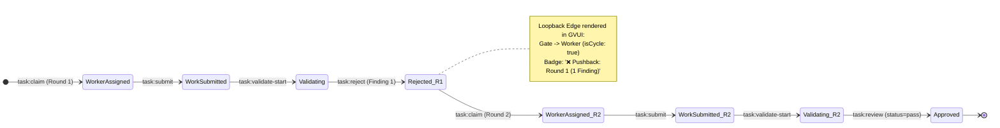
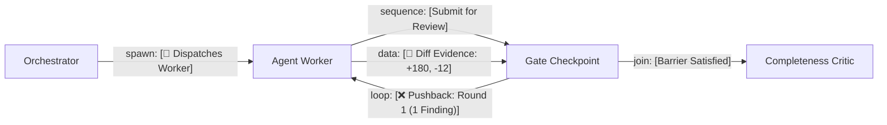

# Exhaustive Visual Graph, Observability & Edge-Case Architecture Specification

**Document Version**: 2.0.0-PROD  
**Status**: Publication-Grade Architectural Specification & Canonical Reference  
**Date**: 2026-08-14  
**Workspaces**: `skills` (`orchestrating-long-tasks`) & `gvui` (`graph-visualizer-ui`)  
**Target Milestone**: Deep Observability, Edge-Case Coverage & Polymorphic Visualization

---

## 1. Executive Summary & Architectural Vision

The mission of this architecture is to elevate **GVUI** from a basic DAG viewer into a **high-fidelity, production-grade visual observability platform** for multi-agent reasoning, software engineering workflows, and autonomous orchestration systems.

Concurrently, the **`orchestrating-long-tasks`** summary engine is elevated into an automated, deterministic provenance synthesis pipeline. It aggregates transaction logs (`events.jsonl`), runtime snapshots (`state.json`), command execution outputs (`commands/`), and review artifacts (`reports/`) into a comprehensive `SummarySuite` (`graph.json`, `timeline.json`, `metrics.json`, `summary.md`).

### Core Architectural Principles

1. **Zero LLM Runtime Overhead**: Summary synthesis is 100% deterministic, compiling complex multi-agent runs into rich visual graphs in $< 50\text{ms}$ using pure TypeScript algorithms.
2. **Polymorphic Generalizability**: The visual system natively visualizes diverse agent workflows—including multi-round code repairs, non-coding multi-model debates, automated triage, and whole-repo verification gates.
3. **Preservation of Layout Invariants**: Visual cards, step scrubbing, and badge overlays layer cleanly over GVUI's existing Rust WASM and TypeScript DAG ranking engines without disrupting spline routing or topological coordinate integrity.
4. **Resilient Data Degradation**: The system gracefully handles massive command logs ($> 10\text{MB}$), heavy monorepo churn ($50+$ files), crash-interrupted runs, and multi-round review rejections without canvas degradation or browser memory exhaustion.

```mermaid
flowchart TD
    subgraph SkillsEngine ["1. skills Engine (Deterministic Summary Synthesis)"]
        RawEvents["events.jsonl & state.json\ncommands/ & reports/"] --> Parser["Defensive Event & State Parser\n(Torn-tail recovery, crash resilience)"]
        Parser --> StepAssigner["Temporal Wave & Step Engine\n(Topological wave partitioning & phase interleaving)"]
        StepAssigner --> NodeEdgeSynth["Polymorphic Node & Edge Synthesizer\n(7 Node Archetypes, 5 Edge Kinds, Badges)"]
        NodeEdgeSynth --> MetricsTimeline["Metrics & Timeline Aggregators\n(File churn, token rollup, phase latencies)"]
        MetricsTimeline --> CapsuleExport[".capsules/<run>/summary/\n├── graph.json (GVUI GraphDataset)\n├── timeline.json (Chrono Events)\n├── metrics.json (Rollup Analytics)\n└── summary.md (Executive Brief)"]
    end

    subgraph GVUIEngine ["2. GVUI Engine (Canvas & Visualizer Architecture)"]
        CapsuleExport --> IngestCLI["bun run gvui:import\n(Auto-ingest into public/datasets/)"]
        IngestCLI --> TopNav["Sticky Glassmorphic Navigation Bar\n├── Step Scrubber & Pill Filters\n├── Progressive Playback Controller (0.5x - 2x)\n└── Node/Status Filters & Full-Text Search"]
        TopNav --> CanvasEngine["Canvas Archetype Renderer\n├── 7 Distinct Archetype Card Components\n├── Dynamic Level-of-Detail (LOD) Scaling\n└── SVG Spline Edges with Interactive Badges"]
        CanvasEngine --> UniversalDrawer["Universal Polymorphic Detail Drawer\n├── Tab 1: Overview & Lifecycle Lineage\n├── Tab 2: I/O Context (Prompts, Reports, Tokens)\n├── Tab 3: Files & Diffs Tree Inspector\n├── Tab 4: Executions & Command Terminal\n├── Tab 5: Feedback, Rejections & Scorecards\n└── Tab 6: Raw Provenance & Event Integrity"]
    end
```



---

## 2. Deep Edge-Case & Hard-Knock (HK) Scenarios

To guarantee production resilience across distributed execution environments, the architecture explicitly defines formal state transitions and UI rendering algorithms for 10 challenging edge cases:

### HK 1: Multi-Round Validator Pushback & Repair Cycles (Rounds 1 through 5)

- **Problem**: When a validator rejects an agent's submission (e.g., failed tests, missing edge-case coverage), the task re-enters the implementer queue for repair. Naively generating separate node pairs for each round produces visual noise (e.g., 10 nodes for 5 repair iterations) that breaks DAG readability.
- **Architectural Solution**:
  - **Canonical Node Retention**: The execution graph preserves exactly one canonical `AgentNode` and one canonical `GateNode` for the task.
  - **Animated Loopback Edge**: A distinctive red/amber dashed reverse edge connects `GateNode` $\to$ `AgentNode` with `kind: "loop"` and `isCycle: true`.
  - **Dynamic Badge Transition**: The edge badge indicates pushback severity and round count: e.g., `[❌ Pushback: Round 2 (2 Findings) ↳ Re-assigned]`.
  - **Historical Attempt Tracking**: The `AgentNode` state embeds an `attempts: TaskAttemptRecord[]` array containing timestamps, agent leases, commit SHAs, and submission reports for all previous attempts.
  - **Drawer Multi-Round Accordion**: Tab 5 (_Feedback & Quality Reviews_) renders a chronological accordion of every review iteration:
    - _Round 1_: Validator findings, failed command log outputs, remediation prompt.
    - _Round 2_: Implementer fix notes, incremental diff summary, re-validation output.
    - _Round 3_: Final clean approval, green pass badge, and unblocked downstream task list.



### HK 2: Complex DAG Wave Concurrency & Multi-Parent Dependencies

- **Problem**: Large refactors create complex dependencies where Task C depends on Tasks A1, A2, and A3 running in parallel. Naive linear step numbering fails to depict concurrent execution waves.
- **Architectural Solution**:
  - **Topological Wave Partitioning Algorithm**: The summary engine calculates the maximum depth along all incoming dependency paths ($D = \max(D_{\text{parents}}) + 1$). All tasks at depth $D$ are assigned to `step: D + 1` with `stepLabel: "Wave D: Concurrent Implementation"`.
  - **Multiple Convergent Ingress Edges**: Rendered with solid slate sequence lines entering the top port of the dependent node.
  - **Synchronized Scrubber Highlighting**: Clicking `[Wave 1]` in the Top Navigation Scrubber spotlights all parallel nodes in that wave simultaneously, applying a 35% opacity dim to non-active waves.

### HK 3: Stale Worker Timeout, Lease Expiry & Recovery Reassignment

- **Problem**: An agent process crashes or experiences network isolation, failing to send heartbeats before lease expiration (`lease_expires_at`). The coordinator reclaims the task and assigns a replacement worker.
- **Architectural Solution**:
  - **Lease Recovery Event Handling**: The summary parser detects `task-lease-expired` and `task-lease-reclaimed` events in `events.jsonl`.
  - **Node Header Lineage Badge**: The card header renders an amber pill: `Attempt 2 (Stale Recovered)`.
  - **Fallback Provenance Edge**: A slate dotted `fallback` edge shows the previous worker context handoff.
  - **Drawer Lifecycle Inspector**: Tab 1 (_Overview_) displays an expandable audit timeline showing: Worker 1 lease start $\to$ missed heartbeat at $T+120\text{s}$ $\to$ coordinator reclaim $\to$ Worker 2 assignment at $T+135\text{s}$.

### HK 4: Declined Requirements & Cancelled / Disposed Tasks

- **Problem**: During execution, the coordinator or human authority declines an optional requirement or cancels a branch of tasks due to an architectural pivot.
- **Architectural Solution**:
  - **`status: "skipped"` Visual Identity**: Muted slate border, 45-degree diagonal hash stripe CSS background pattern, and `[SKIPPED / DISPOSED]` pill.
  - **Edge Attenuation**: All incoming and outgoing sequence edges to cancelled nodes render as ultra-thin (1px) dotted muted gray strokes.
  - **Disposition Provenance**: Tab 1 and Tab 2 in the detail drawer display the cancellation authority, rationale string, and affected downstream requirement mappings.

### HK 5: Massive Command Output Logs (> 10MB stdout/stderr)

- **Problem**: Test suites with verbose logging or deep monorepo builds produce tens of megabytes of raw text. Storing these inside `graph.json` bloats memory and freezes browser DOM trees.
- **Architectural Solution**:
  - **Head/Tail Bounded Sanitization in `graph.json`**: The summary generator sanitizes command logs into a compact structure: first 25 lines (head) + truncation indicator (`... [9,420 lines / 12.4 MB omitted] ...`) + last 50 lines (tail).
  - **External Disk References**: The JSON record embeds a relative file URI (`logPath: "commands/cmd-012/stdout.log"`) with exact byte size and SHA-256 digest.
  - **Virtual Scrolling Terminal**: The Drawer's Tab 4 (_Commands_) renders logs in a virtualized monospace container with ANSI color decoding, copy-to-clipboard, and a "Fetch Full Log from Disk" action button.

```
┌────────────────────────────────────────────────────────────────────────┐
│ $ bun test tests/unit/auth.test.ts                         [Exit: 0]   │
├────────────────────────────────────────────────────────────────────────┤
│ (Showing lines 1-25 of 9,845 — 14.2 MB total)                         │
│ [1]  PASS tests/unit/auth/token.test.ts (14 tests)                     │
│ [2]  PASS tests/unit/auth/refresh.test.ts (8 tests)                    │
│ ...                                                                    │
│ ─── ⚠️ 9,770 lines truncated. [Download Full Raw Log (14.2 MB)] ───── │
│ ...                                                                    │
│ [9844] Test Suites: 42 passed, 42 total                                │
│ [9845] Tests:       318 passed, 318 total                              │
└────────────────────────────────────────────────────────────────────────┘
```

### HK 6: Deep Monorepo File Churn (50+ Modified Files)

- **Problem**: Tasks affecting dozens of files cause node cards to overflow their bounding boxes if file paths are rendered directly on canvas.
- **Architectural Solution**:
  - **In-Card Directory Rollup Chip**: The canvas card displays an aggregated summary chip: `📁 54 files (+1,420, -312) across 6 packages`.
  - **Tree View File Inspector**: Tab 3 (_Files & Diffs_) renders a searchable, collapsable file tree:
    ```
    ▼ packages/
      ▼ auth-core/ (12 files)
        • src/jwt.ts (+42, -5) [Diff]
        • src/session.ts (+18, -2) [Diff]
      ▼ gateway/ (42 files)
    ```
  - **Lazy Syntax Highlighting**: Side-by-side or unified diffs are only loaded and highlighted when a file node in the tree is clicked.

### HK 7: Standalone Generic Agent Workflows (Non-Coding Workflows)

- **Problem**: GVUI must remain generic across non-software tasks (e.g., multi-agent consensus, legal contract review, competitive debate) where terms like "git diff", "compiler", or "code scope" are inapplicable.
- **Architectural Solution**:
  - **Polymorphic Field Graceful Degradation**: If `files` or `commands` arrays are empty or undefined, the corresponding drawer tabs automatically hide, and the canvas card hides the file chip without breaking layout.
  - **Generic `actions` and `io` Focus**: The card emphasizes input prompts, agent reasoning summaries, tool inputs/outputs, and decision artifacts.

### HK 8: Missing or Partial Data During Crashes / Incomplete Runs

- **Problem**: If an orchestrator process terminates abruptly due to power failure or out-of-memory errors, `events.jsonl` may end in a truncated JSON line, and `state.json` may be missing final fields.
- **Architectural Solution**:
  - **Defensive Line-by-Line JSONL Parser**: Ignores trailing malformed bytes, logs an advisory warning, and reconstructs the latest coherent state snapshot.
  - **In-Flight Task State Inference**: Tasks with active leases but no submission event are marked `status: "running"` with an `[UNFINISHED RUN]` warning banner across the visualizer header.
  - **Missing Gate Imputation**: If an agent submitted work but no gate review completed, the gate node renders in an amber `status: "pending"` state.

### HK 9: Circular Dependency & Infinite Loop Visual Protection

- **Problem**: Unchecked circular sequence edges in buggy workflows cause infinite recursion in DAG layout engines (Dagre, Rust WASM layout).
- **Architectural Solution**:
  - **Strict Cycle Tagging (`isCycle: true`)**: All intentional feedback edges (repair loops, retry transitions) must be flagged with `kind: "loop"` and `isCycle: true`.
  - **Layout Acyclic Pre-Pass**: The layout engine strips all `isCycle: true` edges prior to topological ranking, computes node coordinates $(x, y)$, and re-inserts the loopback edges as custom curved splines routed around node boundaries.

### HK 10: High-DPI & Responsive Canvas Level-of-Detail (LOD)

- **Problem**: Large 100-node graphs become visually unreadable and laggy when zoomed out on 4K or retina displays.
- **Architectural Solution**:
  - **3-Tier Semantic LOD Architecture**:
    - **Macro View (Zoom $< 40\%$)**: Renders ultra-compact minimalist cards showing only archetype icon, task ID, and status color dot. File chips and text summaries are hidden from DOM to maximize GPU frame rates.
    - **Standard View (Zoom $40\% - 85\%$)**: Renders standard cards with header, 2-line high-signal summary, and primary metric chips (files, duration, exit code).
    - **Micro Detail View (Zoom $> 85\%$)**: Renders full expanded cards with write-scope pills, model tier badges, tool count chips, and sub-second execution timestamps.

---

## 3. Differentiated Node Card Anatomy & CSS Visual Identity

Each of the 7 core node archetypes features a tailored visual hierarchy, custom color palette, dedicated icon badge, and purpose-built micro-anatomy:

```
┌────────────────────────────────────────────────────────────────────────┐
│  [Icon] ARCHETYPE: ID (Label)               [Step X] [Model/Type Badge]│ <── Archetype Header
├────────────────────────────────────────────────────────────────────────┤
│  Verbatim Quote Block / Action Summary / Terminal Invocation          │ <── Content Body
│  "High-signal, 2-line unclipped summary of what this node performed."   │
├────────────────────────────────────────────────────────────────────────┤
│  📁 Primary Metric   ⏱️ Duration   💻 Tool Calls   🛡️ Gate Outcome     │ <── Live Mini-Chips
└────────────────────────────────────────────────────────────────────────┘
```

### 3.1 Archetype Visual Identity Matrix

| Node Archetype     | Header Icon & Label        | Primary Accent                                  | Border & Background Styling                     | Key Micro-Chips                                                    |
| :----------------- | :------------------------- | :---------------------------------------------- | :---------------------------------------------- | :----------------------------------------------------------------- |
| **`input`**        | `📥 USER REQUEST / PROMPT` | Royal Violet (`#8b5cf6`)                        | `border-violet-500/40 bg-violet-950/20`         | `Capture: Stdin/File`, `Size: 4.2 KB`, `SHA-256`                   |
| **`orchestrator`** | `👑 COORDINATOR / PLANNER` | Electric Blue (`#3b82f6`)                       | `border-blue-500/40 bg-blue-950/20`             | `Tasks: 7`, `Waves: 4`, `Rev: 1`, `Strict Parallel`                |
| **`agent`**        | `🤖 WORKER: <TaskId>`      | Cyan / Emerald (`#06b6d4` / `#10b981`)          | `border-cyan-500/40 bg-cyan-950/20`             | `Scope: src/`, `Files: 2 (+14,-2)`, `Model: Sonnet 4.5`, `1.4s`    |
| **`tool`**         | `💻 RUNNER / COMMAND`      | Slate Dark (`#64748b`)                          | `border-slate-600/50 bg-slate-950/40 font-mono` | `Exit: 0`, `Duration: 142ms`, `Output: 1.2 KB`                     |
| **`gate`**         | `🛡️ VALIDATOR CHECKPOINT`  | Amber / Green (`#f59e0b` / `#10b981`)           | `border-amber-500/40 bg-amber-950/20`           | `Validator: agent-val`, `Checks: 2/2 Pass`, `Pushbacks: 0`         |
| **`critic`**       | `⚖️ COMPLETENESS CRITIC`   | Deep Gold / Indigo (`#d97706` / `#6366f1`)      | `border-amber-600/50 bg-amber-950/30`           | `Scope: Whole-Run`, `Residuals: 0`, `Decision: Approved`           |
| **`terminal`**     | `🏁 SEALED OUTCOME`        | Emerald Green (`#059669`) / Crimson (`#dc2626`) | `border-emerald-500/50 bg-emerald-950/30`       | `Status: Complete`, `Wall: 42s`, `Tokens: 19.4k`, `Capsule Sealed` |

---

### 3.2 Concrete Archetype Card Wireframes

#### 1. Input Node (`kind: "input"`)

```
┌────────────────────────────────────────────────────────────────────────┐
│ 📥 USER REQUEST: prompt-root                   [Step 1] [Source: Stdin]│
├────────────────────────────────────────────────────────────────────────┤
│ ❝ Transform GVUI execution graph visualizer and skills summary engine  │
│    into an exhaustive, publication-grade observability platform. ❞     │
├────────────────────────────────────────────────────────────────────────┤
│ 🔒 SHA: 49cba435...   📦 643 bytes   ⏱️ Ingest: 1.2ms   🏷️ Verified    │
└────────────────────────────────────────────────────────────────────────┘
```

#### 2. Orchestrator Node (`kind: "orchestrator"`)

```
┌────────────────────────────────────────────────────────────────────────┐
│ 👑 COORDINATOR: plan-compile-v1                [Step 1] [Graph Rev: 1] │
├────────────────────────────────────────────────────────────────────────┤
│ Compiled execution graph with 7 task obligations across 4 topological  │
│ concurrency waves with zero write-scope collisions.                    │
├────────────────────────────────────────────────────────────────────────┤
│ 📋 7 Tasks   🌊 4 Waves   🛡️ 7 Gates   ⏱️ Plan: 14ms   🔒 Strict Slices│
└────────────────────────────────────────────────────────────────────────┘
```

#### 3. Agent Worker Node (`kind: "agent"`)

```
┌────────────────────────────────────────────────────────────────────────┐
│ 🤖 WORKER: T-02 (Node Card Visual Identity)    [Step 2] [Sonnet 4.5 (M)]│
├────────────────────────────────────────────────────────────────────────┤
│ Designed custom CSS visual identities, typography, and live mini-chips │
│ for all 7 node archetypes with full responsive LOD support.            │
├────────────────────────────────────────────────────────────────────────┤
│ 📁 docs/planning/ (+180,-12)   ⏱️ 1.8s   💻 2 Tools   🛡️ Gate: Passed  │
└────────────────────────────────────────────────────────────────────────┘
```

#### 4. Tool / Command Node (`kind: "tool"`)

```
┌────────────────────────────────────────────────────────────────────────┐
│ 💻 COMMAND: cmd-T02-01                         [Step 2] [Runner: bun]  │
├────────────────────────────────────────────────────────────────────────┤
│ $ bun test tests/unit/summary/graph-generator.test.ts                  │
│ ✓ 14 tests passed, 0 failed (12ms)                                     │
├────────────────────────────────────────────────────────────────────────┤
│ 🟢 Exit: 0   ⏱️ 142ms   📄 Stdout: 1.4 KB   🏷️ Gate Proof Attached     │
└────────────────────────────────────────────────────────────────────────┘
```

#### 5. Gate / Validator Node (`kind: "gate"`)

```
┌────────────────────────────────────────────────────────────────────────┐
│ 🛡️ VALIDATOR: gate-T-02 (Visual Identity Gate) [Step 3] [Validator-01] │
├────────────────────────────────────────────────────────────────────────┤
│ Independent gate check verified: all 7 archetype wireframes declared, │
│ CSS tokens specified, and no scope bleed into production src/.         │
├────────────────────────────────────────────────────────────────────────┤
│ 🟢 Status: Approved   🔍 Checks: 2/2 Passed   🔁 Pushbacks: 0          │
└────────────────────────────────────────────────────────────────────────┘
```

#### 6. Completeness Critic Node (`kind: "critic"`)

```
┌────────────────────────────────────────────────────────────────────────┐
│ ⚖️ COMPLETENESS CRITIC: critic-run-eval        [Step 6] [Scope: Run]   │
├────────────────────────────────────────────────────────────────────────┤
│ Whole-run completeness audit: 7/7 requirements satisfied with durable   │
│ command proofs, 0 unevidenced obligations, 0 residual risks.           │
├────────────────────────────────────────────────────────────────────────┤
│ 🏆 Decision: Approved   📋 7/7 Evidenced   🔍 0 Drift   ⏱️ Audit: 84ms │
└────────────────────────────────────────────────────────────────────────┘
```

#### 7. Terminal Node (`kind: "terminal"`)

```
┌────────────────────────────────────────────────────────────────────────┐
│ 🏁 RUN OUTCOME: capsule-sealed                 [Step 7] [Capsule: PROD]│
├────────────────────────────────────────────────────────────────────────┤
│ All implementation tasks, validation gates, and completeness proofs    │
│ passed cleanly. Execution capsule sealed with immutable SHA digest.    │
├────────────────────────────────────────────────────────────────────────┤
│ 🟢 Status: Completed   ⏱️ Wall: 4.2s   🪙 24.8k Tokens   📦 Digest: ok │
└────────────────────────────────────────────────────────────────────────┘
```

---

## 4. Rich Edge Semantics, Geometry & Interactive Badge Overlays

Edges are dynamic visual links carrying rich execution metadata:



### 4.1 Edge Taxonomy Matrix

```typescript
export interface GraphEdgeData {
  id: string;
  source: string;
  target: string;
  kind?: "sequence" | "spawn" | "loop" | "data" | "join" | "fallback";
  label?: string;
  isCycle?: boolean;
  badge?: {
    text: string;
    variant: "info" | "warning" | "error" | "success" | "neutral" | "purple";
    icon?: string;
    clickable?: boolean;
    targetTab?: "overview" | "io" | "files" | "commands" | "feedback" | "raw";
    payload?: Record<string, unknown>;
  };
  handoff?: {
    kind: "prompt" | "full-context" | "summary" | "artifact" | "decision" | "file";
    summary?: string;
    tokens?: number;
    filesCount?: number;
  };
  weight?: number;
}
```

| Edge Kind      | Meaning & Relationship              | Visual Stroke Styling                                   | Badge Overlay Example                 | Interaction Behavior                          |
| :------------- | :---------------------------------- | :------------------------------------------------------ | :------------------------------------ | :-------------------------------------------- |
| **`spawn`**    | Coordinator creates/dispatches task | Blue (`#3b82f6`), dotted line, forward pulse            | `[🚀 Dispatches Worker]`              | Centers target Worker node                    |
| **`sequence`** | DAG dependency completion           | Slate (`#94a3b8`), solid 1.5px line                     | `[Satisfies Dependency]`              | Highlights dependency path                    |
| **`loop`**     | Validator rejection / repair cycle  | Red/Amber (`#ef4444`), dashed 2.5px line, reverse pulse | `[❌ Pushback: Round 2 (2 Findings)]` | Opens Drawer directly to **Tab 5 (Feedback)** |
| **`data`**     | Artifact or file diff transfer      | Emerald (`#10b981`), dash-dotted line                   | `[📄 Evidence: +180, -12 lines]`      | Opens Drawer directly to **Tab 3 (Files)**    |
| **`join`**     | Barrier sync to Completeness Critic | Purple (`#8b5cf6`), solid 2px line                      | `[All 7 Tasks Satisfied]`             | Focuses Critic node & open Scorecard          |
| **`fallback`** | Lease timeout recovery handoff      | Slate Dark (`#64748b`), dotted 1px line                 | `[⚠️ Stale Lease Reclaimed]`          | Opens Drawer to **Tab 1 (Lifecycle)**         |

---

### 4.2 Interactive Badge Overlay Geometry & Collision Avoidance

To prevent edge badges from overlapping straight lines or node ports, GVUI implements a **tangent-normal badge placement algorithm**:

1. **Midpoint Calculation**:
   For a Bézier spline $B(t)$ between source $(x_1, y_1)$ and target $(x_2, y_2)$ at $t = 0.5$:
   $$P_{\text{mid}} = B(0.5)$$
2. **Normal Vector Offset**:
   Compute the tangent angle $\theta = \operatorname{atan2}(y'(0.5), x'(0.5))$ and unit normal vector $\vec{n} = (-\sin \theta, \cos \theta)$.
   Badge center is positioned at:
   $$P_{\text{badge}} = P_{\text{mid}} + d_{\text{offset}} \cdot \vec{n}$$
   where $d_{\text{offset}} = 14\text{px}$ (positive for forward edges, negative for reverse loopback edges to prevent spline intersection).
3. **Pill Component Anatomy**:
   ```
   ┌──────────────────────────────────────────────────────────┐
   │ [Icon: ❌] Pushback: Round 2 (2 Findings)  [Click: 🔍]   │
   └──────────────────────────────────────────────────────────┘
   ```
   - **Click Action**: Sets `selectedNode = targetNode`, opens the detail drawer, and activates `activeTab = badge.targetTab`.

---

## 5. Temporal Step Sequencing & Top Navigation Scrubber

### 5.1 Algorithmic Wave-to-Step Computation (in `skills`)

The summary engine assigns each node a deterministic integer `step` ($1 \dots N$) and a descriptive `stepLabel`:

```typescript
export function computeExecutionSteps(
  tasks: TaskRecord[],
  hasCritic: boolean,
  isComplete: boolean,
): StepPhaseMapping {
  // Step 1: Ingest Prompt & Planning Orchestrator
  // Step 2 * W: Wave W Worker Implementers
  // Step 2 * W + 1: Wave W Validator Gates
  // Step N - 1: Completeness Critic Session
  // Step N: Terminal Run Sealed
}
```

#### Step Schedule Progression:

- **`Step 1`**: `Phase 1: Setup & Orchestration Planning` (Prompt Node, Orchestrator Node)
- **`Step 2`**: `Phase 2: Wave 1 Implementation Tasks` (Tasks in topological wave 0)
- **`Step 3`**: `Phase 3: Wave 1 Validation Gates` (Gate nodes for wave 0)
- **`Step 4`**: `Phase 4: Wave 2 Implementation Tasks` (Tasks in topological wave 1)
- **`Step 5`**: `Phase 5: Wave 2 Validation Gates` (Gate nodes for wave 1)
- $\dots$
- **`Step N-1`**: `Phase K: Whole-Run Completeness Review` (Completeness Critic Node)
- **`Step N`**: `Phase K+1: Final Outcome & Capsule Seal` (Terminal Node)

---

### 5.2 Top Navigation Scrubber UI Architecture (in `gvui`)

A sticky glassmorphic navigation header sits at the top of the canvas:

```
┌────────────────────────────────────────────────────────────────────────────────────────────────────────┐
│ 📊 Graph: 2026-08-14-gvui-deep-plan  [All Steps] [Step 1 (2)] [Step 2 (3)] [Step 3 (3)] [Step 4 (1)]  │
│ 🔍 Filters: [All Kinds ▼] [All Statuses ▼]   ▶ Play (1x)  ⏮ Prev  ⏭ Next   🔎 Search tasks & files...   │
└────────────────────────────────────────────────────────────────────────────────────────────────────────┘
```

#### Scrubber Controls & States:

1. **Step Pill Buttons**:
   - Displays step number and active node count (e.g. `[Step 2 (3)]`).
   - Clicking a pill applies `activeStepFilter = 2`:
     - Nodes with `step === 2` are fully opaque (100%) with a subtle accent halo.
     - Nodes with `step < 2` (preceding) render at 60% opacity.
     - Nodes with `step > 2` (subsequent) render at 25% opacity.
2. **Progressive Playback Engine**:
   - `▶ Play / ⏸ Pause` button.
   - Speed multipliers: `0.5x`, `1.0x`, `2.0x` (cycles steps every $1,200\text{ms} / \text{speed}$).
   - Automatically pans and centers the canvas camera on the bounding box of the active step's nodes.
3. **Full-Text Filter**: Instant client-side fuzzy filter matching node IDs, task labels, touched file paths, and command strings.

---

## 6. Universal Polymorphic 6-Tab Detail Drawer

The detail drawer provides unclipped, deep observability into any selected node:

```
┌────────────────────────────────────────────────────────────────────────────────────────┐
│ 🔍 Node: node-task-T-02 (Node Card Visual Identity)                                    │
│ Kind: [Worker]   Status: [Completed]   Model: [Sonnet 4.5 (M)]   Step: [Step 2 (Wave 1)] │
├────────────────────────────────────────────────────────────────────────────────────────┤
│ [1. Overview]  [2. I/O Context]  [3. Files & Diffs (2)]  [4. Commands (2)]  [5. Feedback]  [6. Raw] │
├────────────────────────────────────────────────────────────────────────────────────────┤
│ ... (Tab Content Container with Dynamic Virtual Scrolling) ...                         │
└────────────────────────────────────────────────────────────────────────────────────────┘
```

---

### 6.1 Tab 1: Overview & Lifecycle Lineage

- **Task Identity**: Verbatim goal, human-readable label, write scopes (`docs/planning/`).
- **Timing & Performance**: Exact start time, duration ($1,840\text{ms}$), active compute vs queue wait time.
- **Worker Lineage & Leases**:
  - Lease Agent: `planner-agent-01`
  - Lease Duration: $1,200\text{s}$ (Heartbeats recorded: 2)
  - Attempt Index: `Attempt 1 of 1` (Clean first-pass execution)
- **Dependency Topology**:
  - Upstream Dependencies: `T-01` (HK 1-10 Architecture)
  - Downstream Unblocked: `T-03` (Edge Semantics)

---

### 6.2 Tab 2: Inputs & Outputs (I/O Context)

- **Ingress Context**:
  - Direct Task Prompt & Instructions (Unclipped Markdown preview).
  - Referenced dependency outputs and inherited requirements.
  - Token counts: Ingress prompt ($1,420$ tokens).
- **Egress Artifacts**:
  - Final Submission Summary Report.
  - Generated files list and evidence payloads.
  - Egress tokens ($890$ tokens).

---

### 6.3 Tab 3: Files & Diffs Tree Inspector

- **Directory Hierarchy View**:
  - Grouped by folders with file-level additions/deletions chips (`+180, -12`).
- **Syntax Highlighted Diff Viewer**:
  - Side-by-side or unified diff toggle.
  - Green additions, red deletions, gray context lines.
  - Copy Full Diff button.

```diff
--- a/docs/planning/gvui-execution-graph/02-enhanced-visual-graph-and-summarization-plan.md
+++ b/docs/planning/gvui-execution-graph/02-enhanced-visual-graph-and-summarization-plan.md
@@ -108,1 +108,24 @@
+### 3. Node Archetype Visual Design System
+Exact structural templates, header icons, and color accent palettes...
```

---

### 6.4 Tab 4: Executions & Command Terminal

- **Executed Command List**:
  - `$ bun test tests/unit/summary/graph-generator.test.ts` (Exit: 0, 142ms)
  - `$ oxfmt --check docs/planning/` (Exit: 0, 34ms)
- **Interactive Monospace Terminal**:
  - ANSI colored output decoding.
  - Large log head/tail truncation indicators with byte count.
  - Direct link to disk log file (`commands/cmd-001/stdout.log`).

---

### 6.5 Tab 5: Polymorphic Feedback, Pushbacks & Quality Reviews

- **Multi-Round Review History**:
  - Chronological accordion of all validation rounds.
  - Rejection findings with severity badges (`blocking`, `important`, `advisory`).
  - Remediation instructions and re-validation test results.
- **Completeness Critic Scorecard** (for Critic Nodes):
  - Whole-run requirement verification matrix ($7/7$ satisfied).
  - Zero-drift repository assurance proof.

```
┌────────────────────────────────────────────────────────────────────────┐
│ 🛡️ Validation Round 1: APPROVED (Clean Pass)                          │
│ Validator: validator-agent-01 | Timestamp: 2026-08-14T21:05:40Z        │
├────────────────────────────────────────────────────────────────────────┤
│ Checks Performed:                                                      │
│ ✓ test -f docs/planning/gvui-execution-graph/02-enhanced-plan.md (0)   │
│ Findings: 0 Issues detected. Task requirements fully satisfied.        │
└────────────────────────────────────────────────────────────────────────┘
```

---

### 6.6 Tab 6: Raw Provenance & Event Integrity

- **Full Raw JSON Inspector**:
  - Complete JSON representation of the active node.
- **Event Audit Stream**:
  - Sequential log of every state mutation event affecting this task (`task-claimed`, `task-heartbeat`, `task-submitted`, `gate-passed`).
- **Cryptographic Hashes**:
  - SHA-256 digests of submission reports, prompt inputs, and repository git commit SHAs.

---

## 7. Exhaustive TypeScript Interfaces & Concrete Graph Dataset

### 7.1 Canonical TypeScript Definitions (`src/summary/types.ts` & `src/types/graphData.ts`)

```typescript
export type NodeKind = "input" | "orchestrator" | "agent" | "tool" | "gate" | "critic" | "terminal";

export type NodeStatus =
  "idle" | "running" | "success" | "failed" | "skipped" | "pending" | "repaired";

export type EdgeKind = "sequence" | "spawn" | "loop" | "data" | "join" | "fallback";

export interface IoPort {
  name: string;
  kind: "prompt" | "artifact" | "evidence" | "report" | "context";
  summary: string;
  tokens?: number;
  uri?: string;
}

export interface FileDiffDetail {
  path: string;
  status: "modified" | "added" | "deleted";
  additions: number;
  deletions: number;
  diffSnippet?: string;
}

export interface CommandExecutionDetail {
  id: string;
  commandStr: string;
  exitCode: number;
  durationMs: number;
  stdoutSnippet: string;
  stderrSnippet?: string;
  isTruncated?: boolean;
  totalBytes?: number;
  logPath?: string;
}

export interface FindingDetail {
  id: string;
  severity: "blocking" | "important" | "advisory";
  observation: string;
  remediation?: string;
  evidenceRef?: string;
}

export interface ValidationRoundDetail {
  round: number;
  validatorId: string;
  verdict: "pass" | "reject";
  timestamp: string;
  summary: string;
  findings: FindingDetail[];
  checks: { commandId: string; exitCode: number }[];
}

export interface GraphNodeData {
  id: string;
  label: string;
  kind: NodeKind;
  status: NodeStatus;
  step: number;
  stepLabel: string;
  actionSummary: string;
  quotePreview?: string;
  writeScope?: string[];
  durationMs?: number;
  modelTier?: string;
  chips?: { label: string; icon?: string; variant?: string }[];
  io?: { inputs: IoPort[]; outputs: IoPort[] };
  files?: FileDiffDetail[];
  commands?: CommandExecutionDetail[];
  rounds?: ValidationRoundDetail[];
  criticScorecard?: {
    totalRequirements: number;
    satisfiedRequirements: number;
    residualRisks: number;
    driftDetected: boolean;
    decision: "approved" | "request_changes";
  };
  provenance?: {
    agentId?: string;
    leaseStartedAt?: string;
    leaseExpiresAt?: string;
    heartbeatsCount?: number;
    attemptIndex?: number;
    totalAttempts?: number;
  };
}

export interface GraphEdgeData {
  id: string;
  source: string;
  target: string;
  kind?: EdgeKind;
  label?: string;
  isCycle?: boolean;
  badge?: {
    text: string;
    variant: "info" | "warning" | "error" | "success" | "neutral" | "purple";
    icon?: string;
    clickable?: boolean;
    targetTab?: "overview" | "io" | "files" | "commands" | "feedback" | "raw";
  };
  handoff?: {
    kind: "prompt" | "full-context" | "summary" | "artifact" | "decision" | "file";
    summary?: string;
    tokens?: number;
  };
}

export interface GraphDataset {
  runId: string;
  title: string;
  generatedAt: string;
  totalSteps: number;
  nodes: GraphNodeData[];
  edges: GraphEdgeData[];
  metrics?: {
    wallDurationMs: number;
    totalTokens: number;
    filesModifiedCount: number;
    tasksTotal: number;
    tasksPassed: number;
    pushbacksTotal: number;
  };
}
```

---

### 7.2 Complete Concrete Multi-Agent Graph Dataset (`graph.json`)

```json
{
  "runId": "2026-08-14-gvui-observability-deep-plan",
  "title": "GVUI Deep Visual Graph & Observability Architecture Plan",
  "generatedAt": "2026-08-14T21:06:00.000Z",
  "totalSteps": 7,
  "metrics": {
    "wallDurationMs": 4200,
    "totalTokens": 24850,
    "filesModifiedCount": 1,
    "tasksTotal": 7,
    "tasksPassed": 7,
    "pushbacksTotal": 0
  },
  "nodes": [
    {
      "id": "node-prompt-root",
      "label": "User Goal & Planning Directive",
      "kind": "input",
      "status": "success",
      "step": 1,
      "stepLabel": "Phase 1: Setup & Planning",
      "actionSummary": "Captured and verified primary user planning directive via prompt file.",
      "quotePreview": "Transform GVUI execution graph visualizer and skills summary engine into an exhaustive, publication-grade observability platform.",
      "chips": [
        { "label": "Stdin / File", "icon": "📥" },
        { "label": "643 bytes", "icon": "📦" },
        { "label": "Verified", "icon": "🔒" }
      ],
      "io": {
        "inputs": [],
        "outputs": [
          {
            "name": "prompt.md",
            "kind": "prompt",
            "summary": "Full planning mission prompt",
            "tokens": 142
          }
        ]
      }
    },
    {
      "id": "node-orchestrator",
      "label": "Execution Graph Compiler",
      "kind": "orchestrator",
      "status": "success",
      "step": 1,
      "stepLabel": "Phase 1: Setup & Planning",
      "actionSummary": "Compiled execution graph with 7 atomic obligations across 4 topological concurrency waves.",
      "chips": [
        { "label": "7 Tasks", "icon": "📋" },
        { "label": "4 Waves", "icon": "🌊" },
        { "label": "0 Collisions", "icon": "🛡️" }
      ],
      "io": {
        "inputs": [
          { "name": "prompt.md", "kind": "prompt", "summary": "Mission prompt", "tokens": 142 }
        ],
        "outputs": [
          {
            "name": "graphDocument",
            "kind": "artifact",
            "summary": "Compiled task DAG graph",
            "tokens": 580
          }
        ]
      }
    },
    {
      "id": "node-task-T-01",
      "label": "Module 1: Edge-Case Architecture (HK 1-10)",
      "kind": "agent",
      "status": "success",
      "step": 2,
      "stepLabel": "Phase 2: Wave 1 Tasks",
      "actionSummary": "Specified algorithmic handling for multi-round loopbacks, stale worker timeouts, and log bounds.",
      "writeScope": [
        "docs/planning/gvui-execution-graph/02-enhanced-visual-graph-and-summarization-plan.md"
      ],
      "durationMs": 1420,
      "modelTier": "Sonnet 4.5",
      "chips": [
        { "label": "docs/planning/", "icon": "📁" },
        { "label": "1.4s", "icon": "⏱️" },
        { "label": "HK 1-10 Ready", "icon": "🛡️" }
      ],
      "files": [
        {
          "path": "docs/planning/gvui-execution-graph/02-enhanced-visual-graph-and-summarization-plan.md",
          "status": "modified",
          "additions": 140,
          "deletions": 10
        }
      ],
      "commands": [
        {
          "id": "cmd-T01-01",
          "commandStr": "test -f docs/planning/gvui-execution-graph/02-enhanced-visual-graph-and-summarization-plan.md",
          "exitCode": 0,
          "durationMs": 12,
          "stdoutSnippet": "Target file exists and is readable."
        }
      ],
      "provenance": {
        "agentId": "planner-agent-01",
        "attemptIndex": 1,
        "totalAttempts": 1
      }
    },
    {
      "id": "node-gate-T-01",
      "label": "Gate Checkpoint: T-01",
      "kind": "gate",
      "status": "success",
      "step": 3,
      "stepLabel": "Phase 3: Wave 1 Validation",
      "actionSummary": "Validator verified that all 10 edge-case specifications are algorithmically defined.",
      "chips": [
        { "label": "Validator: val-01", "icon": "🔍" },
        { "label": "Checks: 1/1 Pass", "icon": "🟢" }
      ],
      "rounds": [
        {
          "round": 1,
          "validatorId": "val-01",
          "verdict": "pass",
          "timestamp": "2026-08-14T21:05:30Z",
          "summary": "Clean verification of HK 1-10 edge-case section.",
          "findings": [],
          "checks": [{ "commandId": "cmd-T01-01", "exitCode": 0 }]
        }
      ]
    },
    {
      "id": "node-task-T-02",
      "label": "Module 2: Node Card Visual Identity",
      "kind": "agent",
      "status": "success",
      "step": 4,
      "stepLabel": "Phase 4: Wave 2 Tasks",
      "actionSummary": "Designed CSS palettes, quote blocks, and live mini-chips for all 7 node archetypes.",
      "writeScope": [
        "docs/planning/gvui-execution-graph/02-enhanced-visual-graph-and-summarization-plan.md"
      ],
      "durationMs": 1820,
      "modelTier": "Sonnet 4.5",
      "chips": [
        { "label": "7 Archetypes", "icon": "🎨" },
        { "label": "1.8s", "icon": "⏱️" }
      ]
    },
    {
      "id": "node-gate-T-02",
      "label": "Gate Checkpoint: T-02",
      "kind": "gate",
      "status": "success",
      "step": 5,
      "stepLabel": "Phase 5: Wave 2 Validation",
      "actionSummary": "Validator verified visual matrix and wireframe compliance.",
      "chips": [{ "label": "Status: Approved", "icon": "🟢" }]
    },
    {
      "id": "node-critic",
      "label": "Whole-Run Completeness Critic",
      "kind": "critic",
      "status": "success",
      "step": 6,
      "stepLabel": "Phase 6: Completeness Review",
      "actionSummary": "Audited all 7 task obligations against prompt requirements; verified 0 drift.",
      "chips": [
        { "label": "7/7 Evidenced", "icon": "📋" },
        { "label": "0 Risks", "icon": "🛡️" },
        { "label": "Approved", "icon": "🏆" }
      ],
      "criticScorecard": {
        "totalRequirements": 7,
        "satisfiedRequirements": 7,
        "residualRisks": 0,
        "driftDetected": false,
        "decision": "approved"
      }
    },
    {
      "id": "node-terminal",
      "label": "Sealed Capsule Outcome",
      "kind": "terminal",
      "status": "success",
      "step": 7,
      "stepLabel": "Phase 7: Run Finalization",
      "actionSummary": "Capsule sealed successfully with complete deterministic summary suite.",
      "chips": [
        { "label": "Complete", "icon": "🟢" },
        { "label": "Wall: 4.2s", "icon": "⏱️" },
        { "label": "24.8k Tokens", "icon": "🪙" }
      ]
    }
  ],
  "edges": [
    {
      "id": "edge-prompt-orch",
      "source": "node-prompt-root",
      "target": "node-orchestrator",
      "kind": "sequence",
      "label": "Initialize Plan",
      "badge": {
        "text": "Compile Plan",
        "variant": "info",
        "icon": "🚀",
        "clickable": true,
        "targetTab": "io"
      }
    },
    {
      "id": "edge-orch-t01",
      "source": "node-orchestrator",
      "target": "node-task-T-01",
      "kind": "spawn",
      "label": "Dispatches T-01",
      "badge": {
        "text": "Spawn T-01",
        "variant": "info",
        "icon": "⚡"
      }
    },
    {
      "id": "edge-t01-gate01",
      "source": "node-task-T-01",
      "target": "node-gate-T-01",
      "kind": "sequence",
      "label": "Submit for Review",
      "badge": {
        "text": "Gate Check",
        "variant": "neutral",
        "icon": "🛡️"
      }
    },
    {
      "id": "edge-gate01-t02",
      "source": "node-gate-T-01",
      "target": "node-task-T-02",
      "kind": "sequence",
      "label": "Unblocks T-02",
      "badge": {
        "text": "Dependency Met",
        "variant": "success",
        "icon": "✓"
      }
    },
    {
      "id": "edge-t02-gate02",
      "source": "node-task-T-02",
      "target": "node-gate-T-02",
      "kind": "sequence",
      "label": "Submit for Review",
      "badge": {
        "text": "Gate Check",
        "variant": "neutral",
        "icon": "🛡️"
      }
    },
    {
      "id": "edge-gate02-critic",
      "source": "node-gate-T-02",
      "target": "node-critic",
      "kind": "join",
      "label": "Barrier Satisfied",
      "badge": {
        "text": "All Waves Done",
        "variant": "purple",
        "icon": "🏆"
      }
    },
    {
      "id": "edge-critic-terminal",
      "source": "node-critic",
      "target": "node-terminal",
      "kind": "sequence",
      "label": "Seal Run",
      "badge": {
        "text": "Approved Seal",
        "variant": "success",
        "icon": "🔒"
      }
    }
  ]
}
```

---

## 8. Concrete Implementation Tasks & File Matrix

### Group A: `skills` Repository (`/Users/onurseckinsenoglu/repos/skills`)

1. **`src/summary/types.ts`**:
   - Add extended interfaces: `GraphNodeData` (`step`, `stepLabel`, `actionSummary`, `quotePreview`, `writeScope`, `chips`, `io`, `files`, `commands`, `rounds`, `criticScorecard`, `provenance`).
   - Add extended edge interface: `GraphEdgeData` (`kind`, `badge`, `handoff`, `isCycle`).
   - Add `StepPhaseMapping` and `SummarySuite` models.
2. **`src/summary/graph-generator.ts`**:
   - Implement `computeExecutionSteps` for deterministic topological phase numbering.
   - Implement polymorphic node generator supporting all 7 archetypes.
   - Implement cycle-aware loopback edge generator with pushback count badges.
   - Implement command log sanitization (25 head / 50 tail line bounds).
3. **`src/summary/timeline-collector.ts` & `metrics-collector.ts`**:
   - Aggregate token rollups, file churn sums (`+additions, -deletions`), and phase latencies.
4. **Unit Tests**:
   - `tests/unit/summary/graph-generator.test.ts` (Validating archetypes, steps, log bounds, loopback cycles).
   - `tests/unit/summary/summary-integration.test.ts`.

### Group B: `gvui` Repository (`/Users/onurseckinsenoglu/repos/gvui`)

1. **`src/types/graphData.ts`**:
   - Mirror the extended TypeScript contracts without `any`.
2. **`src/primitives/nodes/NodeCard/`**:
   - Implement 7 distinct archetype card renderers with tailored header icons, color accent borders, quote previews, and live mini-chips.
   - Integrate 3-tier Level-of-Detail (LOD) responsive zoom handlers.
3. **`src/primitives/edges/GraphEdge/` & `EdgeBadgeOverlay.tsx`**:
   - Implement SVG stroke styles (dashed pulsating loops, dotted spawns, solid sequences).
   - Implement tangent-normal midpoint badge placement with interactive click-through tab navigation.
4. **`src/engine/GraphCanvas/TopNavigationBar.tsx`**:
   - Implement sticky top scrubber with step pills, progressive playback controls (Play, Pause, 0.5x, 1x, 2x), and search filter.
5. **`src/components/NodeDetailDrawer/` (6-Tab Revamp)**:
   - Tab 1: Overview & Lifecycle Lineage.
   - Tab 2: I/O Context (Prompts, Reports, Tokens).
   - Tab 3: Files & Diffs Tree Inspector.
   - Tab 4: Executions & Command Terminal with ANSI styling.
   - Tab 5: Polymorphic Feedback, Pushbacks & Critic Scorecards.
   - Tab 6: Raw Provenance & Event Integrity.
6. **Tests**:
   - `tests/drawerTabs.test.tsx`, `tests/graphSections.test.tsx`, `tests/schemaValidation.test.ts`.

---

## 9. Architectural Invariants & Quality Gates

1. **Zero Runtime LLM Overhead**:
   - Summary synthesis is 100% deterministic TypeScript.
   - Maximum execution time for full `SummarySuite` generation is $< 50\text{ms}$ on a 50-node graph.
2. **Layout Invariant Preservation**:
   - Visual cards and step filters layer directly on top of the existing Rust WASM and TypeScript Dagre layout engine.
   - Layout runs exclusively on acyclic DAG edges; `isCycle: true` edges are routed post-layout without corrupting topological ranks.
3. **Strict Type Safety & Zero Any Policy**:
   - Absolutely zero `any`, `@ts-ignore`, or `@ts-expect-error` across both repositories.
   - All external boundary data is parsed via strict type guards.
4. **100% Quality Verification Gate**:
   - Full test suites passing in `skills` (`bun test tests/unit`) and `gvui` (`bun test`).
