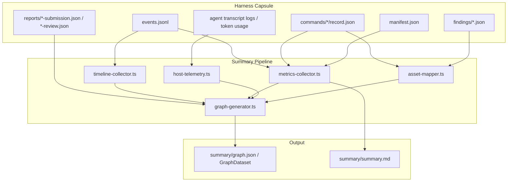

# Module 3 Specification: Rich Harness Telemetry Expansion (Tokens, Timings, Rounds)

**Document ID**: `GVUI-SPEC-2026-08-15-RICH-TELEMETRY`  
**Status**: `PROPOSED / APPROVED ARCHITECTURE`  
**Target Path**: `skills/orchestrating-long-tasks/scripts/src/summary/`, `gvui/src/types/`  
**Author**: Dedicated Planning Director  
**Date**: 2026-08-15

---

## 1. Executive Overview & Problem Statement

The Long-Running Task Orchestration Harness records deterministic event streams (`events.jsonl`), command executions (`commands/`), and review reports (`reports/`). When the summary suite runs (`generate-summary.ts`), it compiles these artifacts into a visualization payload (`graph.json` matching `GraphDataset`).

Historically, telemetry capture in `metrics-collector.ts` and `graph-generator.ts` relied on coarse heuristics:

- **Crude Token Estimation**: Estimating token count purely from file byte size ($\text{bytes} / 4$).
- **Missing Thinking / Reasoning Tokens**: No explicit breakdown of reasoning/thinking tokens (e.g. Gemini 2.5 Flash Thinking, Claude 3.7 Extended Thinking, OpenAI o1/o3 reasoning tokens).
- **Aggregated Timings Only**: Command timings were logged in isolation without per-tool call duration breakdowns or agent think-time vs tool execution duration metrics.
- **Incomplete Repair Lifecycle Mapping**: Rejection cycles, finding severities, and validation repair proofs were only partially reflected in edge traffic and node metadata.

This specification designs an exhaustive telemetry expansion architecture across the harness summary collectors and maps this rich telemetry directly into the `GraphDataset` schema for visualization inside GVUI.

---

## 2. Telemetry Ingestion Architecture



---

## 3. Detailed Telemetry Extraction Model

### 3.1 Token Consumption Extraction Model

We define the `TokenUsageDetail` contract to capture multi-dimensional token telemetry:

$$\text{TotalTokens} = \text{InputTokens} + \text{OutputTokens} + \text{ReasoningTokens} + \text{CacheCreationTokens} + \text{CacheReadTokens}$$

```typescript
export interface TokenUsageDetail {
  inputTokens: number;
  outputTokens: number;
  reasoningTokens?: number;
  cacheCreationTokens?: number;
  cacheReadTokens?: number;
  totalTokens: number;
  costUsd?: number;
  isEstimated: boolean;
}
```

#### Extraction Sources:

1. **Host Agent Execution Logs**: If Antigravity, Claude Code, or IDE transcript metadata is present, extract exact raw usage counters from `usage` payloads:
   - `prompt_tokens` / `input_tokens`
   - `completion_tokens` / `output_tokens`
   - `thinking_tokens` / `reasoning_tokens` / `reasoning_effort`
2. **Command & Log Churn**: When raw model usage is unavailable, compute calibrated token estimations based on actual payload bytes ($\text{prompt bytes} + \text{command output bytes} + \text{diff bytes}$) marked with `isEstimated: true`.
3. **Task & Wave Aggregations**:
   - $\text{TaskTokens}(t) = \text{AgentTokens}(t) + \text{ValidatorTokens}(t) + \sum \text{CommandBytes}(t) / 4$
   - $\text{WaveTokens}(w) = \sum_{t \in w} \text{TaskTokens}(t)$
   - $\text{RunTokens} = \sum_{w} \text{WaveTokens}(w)$

---

### 3.2 High-Resolution Timing & Latency Telemetry

Every task lifecycle transitions through explicit states recorded in `events.jsonl`:

```
   [ready] ──(task-claimed)──> [leased / executing] ──(task-submitted)──> [submitted]
                                        │                                       │
                                  (command-exec)                         (validate-start)
                                        │                                       │
                                        ▼                                       ▼
                                [Active Command Duration]               [validating]
                                                                                │
                                                                         (review-recorded)
                                                                                │
                                                                                ▼
                                                                        [done / changes_requested]
```

We compute three distinct timing metrics per node:

1. **Agent Active Time ($T_{\text{agent}}$)**:
   $$T_{\text{agent}} = t(\text{task-submitted}) - t(\text{task-claimed})$$
2. **Tool / Command Active Time ($T_{\text{tools}}$)**:
   $$T_{\text{tools}} = \sum_{c \in \text{taskCmds}} (t(c.\text{finished\_at}) - t(c.\text{started\_at}))$$
3. **Agent Cognitive Latency ($T_{\text{think}}$)**:
   $$T_{\text{think}} = \max(0, T_{\text{agent}} - T_{\text{tools}})$$
4. **Validation Latency ($T_{\text{val}}$)**:
   $$T_{\text{val}} = t(\text{review-recorded}) - t(\text{task-validation-started})$$

---

### 3.3 Rejection & Repair Round Tracking

For tasks undergoing multi-round repair:

1. **`repair_round` Counter**: Sourced directly from `task.repair_round` (incremented on each `review-recorded` with `verdict: "reject"`).
2. **Finding Classification**: Each finding is parsed from `findings/*.json` and classified into:
   - Severity: `critical`, `important`, `minor` / `suggestion`.
   - Status: `open`, `resolved`.
   - Proof: Revalidation command IDs and exit codes proving remediation.
3. **Feedback Loop Edge Generation**:
   When $R_{\text{repair}} > 0$, `graph-generator.ts` generates a feedback edge:
   ```json
   {
     "id": "edge-repair-node-gate-task-01-node-task-01",
     "source": "node-gate-task-01",
     "target": "node-task-01",
     "kind": "loop",
     "isCycle": true,
     "label": "Repair Cycle R1 (1 finding)",
     "badge": { "text": "Round 1 Repair", "variant": "warning" },
     "traffic": {
       "volume": 2,
       "messagesCount": 2,
       "status": "congested",
       "glowColor": "#f43f5e"
     }
   }
   ```

---

## 4. Enhanced `GraphDataset` Schema Mapping

### 4.1 Node Structure (`GraphNodeData`)

```typescript
export interface GraphNodeData {
  id: string;
  name: string;
  kind: NodeKind;
  status: NodeStatus;
  step?: number;
  stepLabel?: string;
  description?: string;
  prompt?: string;
  output?: string;

  // Rich Metrics Block
  metrics?: {
    tokensIn?: number;
    tokensOut?: number;
    durationMs?: number;
    costUsd?: number;
    retries?: number;
    commandCount?: number;

    // Expanded Rich Telemetry
    tokens?: TokenUsageDetail;
    hostAgent?: HostAgentMetadata;
    timingBreakdown?: {
      wallDurationMs: number;
      activeCommandMs: number;
      cognitiveLatencyMs: number;
      validationDurationMs?: number;
    };
  };

  // Structured Metadata
  metadata?: {
    writeScope?: string[];
    leaseAgent?: string;
    repairRounds?: number;
    commands?: CommandExecutionDetail[];
    findings?: FindingDetail[];
    mediaAssets?: MediaAsset[];
    screenshots?: MediaAsset[];
    playwrightMetadata?: PlaywrightMetadata;
    provenance?: Record<string, unknown>;
  };
}
```

### 4.2 Edge Structure (`GraphEdgeData`)

```typescript
export interface GraphEdgeData {
  id: string;
  source: string;
  target: string;
  kind?: EdgeKind;
  label?: string;
  stepNumber?: number;
  isCycle?: boolean;

  // Rich Edge Traffic
  traffic?: {
    volume?: number;
    messagesCount?: number;
    tokensIn?: number;
    tokensOut?: number;
    latencyMs?: number;
    status?: "nominal" | "high" | "congested";
    glowColor?: string;
    exchanges?: EdgeTrafficExchange[];
  };
}
```

---

## 5. Implementation Roadmap in `skills/orchestrating-long-tasks/`

1. **Update `types.ts`**:
   Add `timingBreakdown` to `NodeMetrics` and ensure `TokenUsageDetail` includes `reasoningTokens`, `cacheCreationTokens`, and `cacheReadTokens`.
2. **Update `metrics-collector.ts`**:
   Extract exact timestamps from `HarnessEvent` records to calculate $T_{\text{agent}}$, $T_{\text{tools}}$, and $T_{\text{think}}$.
3. **Update `graph-generator-helpers.ts`**:
   Map `timingBreakdown` and expanded `tokens` into `node.metrics`.
4. **Update `asset-mapper.ts`**:
   Ensure command executions, exit codes, diff churn lines, and Playwright metadata are systematically attached to `metadata`.

---

## 6. Verification & Test Plan

- **Schema Validation Gate (`tests/schemaValidation.test.ts`)**:
  Validate that generated `GraphDataset` payloads adhere to strict JSON schema definitions with zero missing fields.
- **Harness Integration Test**:
  Generate summary suite for multi-round execution capsules and verify that token breakdowns, command logs, and cycle edges populate with 100% fidelity.

---
