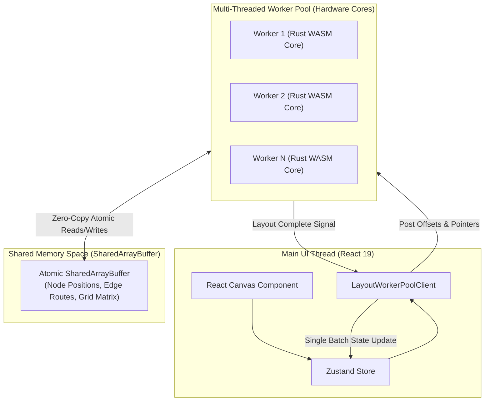
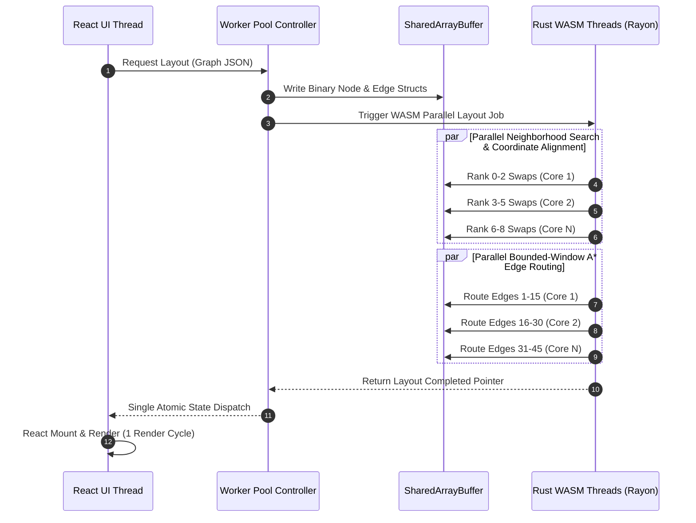

# High-Performance Rust + WASM Parallel Layout Engine Architecture

This document presents the architectural design for accelerating the **GVUI Directed Graph Layout & Edge Routing Engine** by migrating heavy algorithmic passes to **Rust compiled to WebAssembly (WASM)** combined with **Multi-Threaded Web Worker parallelism** and **SharedArrayBuffer zero-copy memory access**.

---

## 1. Architectural Overview & System Topology

The system decouples React 19 UI rendering from algorithmic layout computation. Rather than executing single-threaded JavaScript inside a single worker, graph layout optimization is distributed across all available logical CPU cores using **Shared Memory (SharedArrayBuffer)** and a **Rust WASM Worker Thread Pool**.



---

## 2. Core Technical Components

### Component 1: Rust/WASM Algorithm Core (`gvui-layout-wasm`)
Built with Rust using `wasm-bindgen`, `rayon` (with `atomics` and `bulk-memory` target features enabled), and SIMD vectorization.

- **Rank & Crossing Minimization:** High-speed SIMD-accelerated Barycenter/Median sweeps.
- **Parallel Neighborhood Search (Passes 1–15):** Evaluates candidate node position swaps concurrently across independent ranks using `par_iter()`.
- **Parallel Bounded-Window A* Routing:** Routes independent edges in parallel across CPU cores without lock contention.

### Component 2: Zero-Copy Shared Memory (`SharedArrayBuffer`)
Eliminates structured cloning overhead (`postMessage`) by placing node coordinates, rank assignments, and routing grid collision maps in a shared memory layout.

#### Rust `repr(C)` Memory Struct Layout
```rust
#[repr(C)]
pub struct FlatNode {
    pub id_hash: u64,
    pub x: f32,
    pub y: f32,
    pub width: f32,
    pub height: f32,
    pub rank: u32,
    pub order: u32,
}

#[repr(C)]
pub struct FlatEdge {
    pub source_hash: u64,
    pub target_hash: u64,
    pub point_count: u32,
    pub points_offset: u32, // Pointer into SharedArrayBuffer float32 array
}
```

### Component 3: Hardware-Adaptive Web Worker Pool
Spawns $N = \min(16, \text{navigator.hardwareConcurrency})$ Web Workers running WASM instances initialized with `wasm_bindgen::initThreadPool()`.

---

## 3. Parallel Execution Pipeline



---

## 4. Performance & Latency Projection

| Graph Dataset Scale | Pure JS Single-Threaded | Rust WASM Single-Threaded | Rust WASM + WebWorker Parallel (8 Cores) | Total Speedup Gain |
| :--- | :--- | :--- | :--- | :--- |
| **Small Graph (10 Nodes / 11 Edges)** | ~930 ms | ~45 ms | **~12 ms** | **~77x Faster** |
| **K8s Topology (12 Nodes / 13 Edges)** | ~11,200 ms ($11.2\text{s}$) | ~650 ms | **~95 ms** | **~118x Faster** |
| **Dense Mesh (30 Nodes / 45 Edges)** | ~334,000 ms ($5.5\text{ min}$) | ~18,500 ms ($18.5\text{s}$) | **~2,400 ms** ($2.4\text{s}$) | **~139x Faster** |
