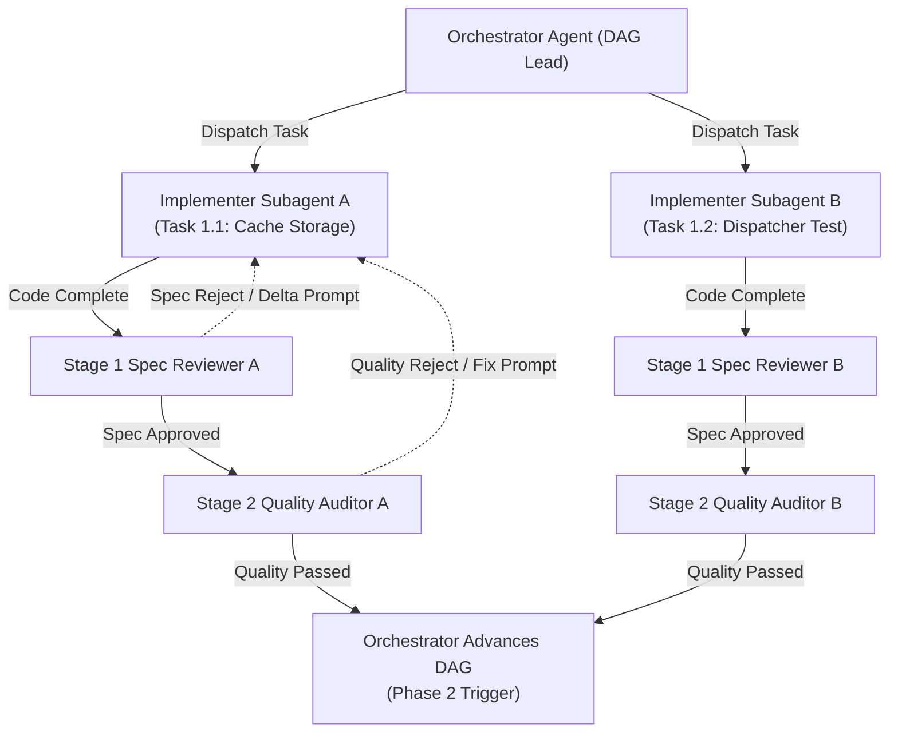

# Master Architecture & Multi-Agent Execution Plan: Layout Engines, Circular Loader & TanStack Router

> **Document Type:** Comprehensive Technical Architecture & Multi-Agent Execution Plan  
> **Target Path:** `docs/superpowers/plans/2026-07-31-master-architecture-and-execution-plan.md`  
> **Status:** Pending User Review  

---

## 1. System Overview & Root Cause Analysis

### 1.1 Root Cause Analysis of Active Bugs

#### Bug 1: Non-`top-down` Layout Modes Failing (`left-right`, `force`, `radial`)
- **Root Cause**: In [GraphCanvas/index.tsx](file:///Users/onurseckinsenoglu/repos/gvui/src/engine/GraphCanvas/index.tsx#L50-L63), the storage cache lookup key was generated strictly from `generateDatasetSignature(dataset)` without including `layoutMode`.
- **Impact**: Once a graph layout was calculated for `top-down`, selecting `left-right`, `force`, or `radial` returned the cached `top-down` node coordinates from `localStorage`, causing non-`top-down` layout switches to fail or display top-down coordinates.
- **Fix**: Namespace storage cache keys by both `layoutMode` and `datasetSignature`:  
  `gvui_layout_cache_v2_${layoutMode}_${datasetSignature}`

#### Bug 2: Unaesthetic & Stalling Loader Progression
- **Root Cause**: The loader overlay used a rectangular card and skipped visual stage transitions because progress percentages jumped in 20% steps and stalled at stage 2/3.
- **Fix**: Build a minimalist SVG **Circular Progress Ring Loader** with centered percentage text, gradient ring strokes, and a 60 FPS `requestAnimationFrame` micro-tick interpolator hook so percentages advance smoothly without stalling or jumping.

#### Bug 3: Legacy URL History Mutations & State Sync Loops
- **Root Cause**: Navigating between datasets and testing pages relied on `window.history.replaceState` and custom URL query string parsing in `App.tsx`.
- **Fix**: Integrate `@tanstack/react-router` with clean, type-safe routes: `/`, `/graphs/$fileId`, and `/testing`.

---

## 2. System Architecture & Data Flow

```
                                  ┌──────────────────────────────────────────┐
                                  │      TanStack Router (@tanstack/react-router) │
                                  │  /graphs/$fileId  |  /testing            │
                                  └────────────────────┬─────────────────────┘
                                                       │
                                        URL Param / Navigation Event
                                                       │
                                                       ▼
                                  ┌──────────────────────────────────────────┐
                                  │         Graph Store (Zustand)            │
                                  │  currentFile, dataset, layoutMode, node  │
                                  └────────────────────┬─────────────────────┘
                                                       │
                                              Dataset & Mode Key
                                                       │
                                                       ▼
                                  ┌──────────────────────────────────────────┐
                                  │      Isolated Storage Cache Query        │
                                  │  gvui_layout_cache_v2_${mode}_${sig}     │
                                  └──────────┬────────────────────┬──────────┘
                                             │                    │
                                     [Cache Hit: 0ms]     [Cache Miss]
                                             │                    │
                                             ▼                    ▼
                                  ┌──────────────────┐ ┌─────────────────────┐
                                  │ Direct Mount     │ │ Immediate Unmount & │
                                  │ (Instant Render) │ │ Spawn Loading Screen│
                                  └──────────────────┘ └──────────┬──────────┘
                                                                  │
                                                                  ▼
                                                       ┌─────────────────────┐
                                                       │ WebWorker Execution │
                                                       │ Multi-Thread Pool   │
                                                       └──────────┬──────────┘
                                                                  │
                                                        Stream Progress Events
                                                                  │
                                                                  ▼
                                                       ┌─────────────────────┐
                                                       │ Sleek Radial Progress│
                                                       │ Loader Overlay UI   │
                                                       └──────────┬──────────┘
                                                                  │
                                                            Render Ready (100%)
                                                                  │
                                                                  ▼
                                                       ┌─────────────────────┐
                                                       │ Save to Storage &   │
                                                       │ Mount Canvas        │
                                                       └─────────────────────┘
```

---

## 3. Mathematical Formulations & Algorithmic Specifications

### 3.1 Top-Down Sugiyama Layering Engine

#### 3.1.1 Feedback Arc Set (FAS) Cycle Reversal via 3-Color DFS Traversal
Given a directed graph $G = (V, E)$ containing potential cycles, DAG invariant enforcement is achieved by identifying back-edges via depth-first search vertex coloring $C: V \to \{\text{WHITE}, \text{GRAY}, \text{BLACK}\}$.

1. **Initialization**: $\forall v \in V, C(v) \gets \text{WHITE}$.
2. **Traversal & Edge Reversal**: For active traversal node $u$ with $C(u) = \text{GRAY}$, for each outgoing edge $e = (u, v) \in E$:
   - If $C(v) = \text{GRAY}$, edge $e$ is a back-edge creating a directed cycle. Reverse $e$:
     $$E \gets (E \setminus \{(u, v)\}) \cup \{(v, u)\}, \quad E_{\text{reversed}} \gets E_{\text{reversed}} \cup \{(v, u)\}$$
   - If $C(v) = \text{WHITE}$, recursively process $v$.
3. **Termination**: Set $C(u) \gets \text{BLACK}$. Yields acyclic DAG $G' = (V, E')$.

#### 3.1.2 Longest-Path Rank Assignment Equations
Assign discrete layer ranks $r: V \to \mathbb{Z}_{\ge 0}$ to guarantee strictly forward edge orientation:

- **Source Vertices**: For $V_{\text{src}} = \{ v \in V \mid \text{in-degree}(v) = 0 \}$:
  $$r(v) = 0, \quad \forall v \in V_{\text{src}}$$
- **Topological Rank Recurrence**: For all edges $(u, v) \in E'$:
  $$r(v) = \max_{(u, v) \in E'} \{ r(u) + 1 \}$$
- **Vertical Rank Coordinate Mapping**:
  $$y(v) = y_0 + r(v) \cdot (h_{\max} + s_y)$$
  where $y_0$ is canvas origin, $h_{\max} = \max_{v \in V} \{\text{height}(v)\}$, and $s_y = 80\text{px}$ is vertical rank separation gap.

#### 3.1.3 Barycentric Crossing Minimization Sweeps
For adjacent rank layers $L_k$ and $L_{k+1}$ with ordered positions $\text{pos}(v) \in \{1, \dots, |L_k|\}$, edge crossings are minimized by computing the barycentric center metric $B(u)$ for each node $u \in L_{k+1}$:

$$B(u) = \begin{cases} \frac{1}{|\text{pred}(u)|} \sum_{v \in \text{pred}(u)} \text{pos}(v) & \text{if } |\text{pred}(u)| > 0 \\ \text{pos}(u) & \text{if } \text{pred}(u) = \emptyset \end{cases}$$

where $\text{pred}(u) = \{ v \in L_k \mid (v, u) \in E' \}$.
Nodes in $L_{k+1}$ are sorted in ascending order of $B(u)$. Alternating downward ($k = 0 \to N-2$) and upward ($k = N-1 \to 1$) sweeps execute for $K_{\max} = 24$ iterations or until crossing count convergence $\Delta \text{crossings} = 0$.

---

### 3.2 A* Orthogonal Edge Routing

#### 3.2.1 Grid Graph Discretization
The canvas vector space is discretized into an orthogonal grid graph with fixed step resolution $g = 20\text{px}$. Coordinates map to discrete grid nodes $n = (x_g, y_g) \in \mathbb{Z}^2$:

$$(x_g, y_g) = \left( \lfloor x / g \rceil, \lfloor y / g \rceil \right)$$

Neighbors $N(n) = \{ (x_g \pm 1, y_g), (x_g, y_g \pm 1) \}$ define orthogonal 4-directional transitions.

#### 3.2.2 Manhattan Distance Heuristic
Path evaluation function $f(n) = g(n) + h(n)$ uses admissible Manhattan distance heuristic $h(n)$ from grid node $n = (x_n, y_n)$ to target pin $T = (x_t, y_t)$:

$$h(n) = |x_n - x_t| + |y_n - y_t|$$

#### 3.2.3 Path Cost Function & Penalty Accumulation
Accumulated path cost $g(n_{\text{next}})$ along step vector $\vec{d}_{\text{next}} = n_{\text{next}} - n$ given previous direction $\vec{d}_{\text{prev}} = n - n_{\text{prev}}$:

$$g(n_{\text{next}}) = g(n) + c_{\text{step}} + \text{Penalty}_{\text{turn}}(\vec{d}_{\text{prev}}, \vec{d}_{\text{next}}) + \text{Penalty}_{\text{cross}}(n_{\text{next}})$$

Where:
- **Base Step Cost**: $c_{\text{step}} = 1$.
- **Turn Penalty Factor ($w_{\text{turn}} = 50$)**:
  $$\text{Penalty}_{\text{turn}}(\vec{d}_{\text{prev}}, \vec{d}_{\text{next}}) = \begin{cases} 0 & \text{if } \vec{d}_{\text{prev}} = \vec{d}_{\text{next}} \\ w_{\text{turn}} & \text{if } \vec{d}_{\text{prev}} \perp \vec{d}_{\text{next}} \end{cases}$$
- **Crossing Penalty Factor ($w_{\text{cross}} = 500$)**:
  $$\text{Penalty}_{\text{cross}}(n_{\text{next}}) = w_{\text{cross}} \cdot \text{occupancy\_count}(n_{\text{next}})$$

---

### 3.3 Left-Right Engine

#### 3.3.1 Spatial Matrix Coordinate Permutation $M_{\text{LR}}$
Layout transposition from Top-Down space $\mathbf{p}_{\text{TD}} = [x_{\text{TD}}, y_{\text{TD}}, 1]^T$ to Left-Right space $\mathbf{p}_{\text{LR}} = [x_{\text{LR}}, y_{\text{LR}}, 1]^T$ is governed by linear permutation matrix $M_{\text{LR}}$:

$$\begin{bmatrix} x_{\text{LR}} \\ y_{\text{LR}} \\ 1 \end{bmatrix} = M_{\text{LR}} \begin{bmatrix} x_{\text{TD}} \\ y_{\text{TD}} \\ 1 \end{bmatrix} = \begin{bmatrix} 0 & 1 & 0 \\ 1 & 0 & 0 \\ 0 & 0 & 1 \end{bmatrix} \begin{bmatrix} x_{\text{TD}} \\ y_{\text{TD}} \\ 1 \end{bmatrix} = \begin{bmatrix} y_{\text{TD}} \\ x_{\text{TD}} \\ 1 \end{bmatrix}$$

Bounding box dimensions swap accordingly: $w_{\text{LR}} = h_{\text{TD}}$ and $h_{\text{LR}} = w_{\text{TD}}$.

#### 3.3.2 Horizontal Rank Separation Bounds
For horizontal rank layer $k$ derived from rank assignment $r(v) = k$:

$$x_{\text{LR}}^{(k)} \ge x_{\text{LR}}^{(k-1)} + w_{\max}^{(k-1)} + \delta_{\text{rank}}$$

where $w_{\max}^{(k-1)} = \max_{v \in L_{k-1}} \{\text{width}(v)\}$ and $\delta_{\text{rank}} = 120\text{px}$ defines minimum inter-rank separation bound.

---

### 3.4 Force Engine

#### 3.4.1 Electrostatic Coulomb Repulsion
Non-adjacent nodes $i, j$ exert inverse-square repulsive forces with Coulomb constant $k_r = 50000$:

$$\mathbf{F}_{r, ij} = k_r \cdot \frac{\mathbf{r}_i - \mathbf{r}_j}{\|\mathbf{r}_i - \mathbf{r}_j\|^3}$$

#### 3.4.2 Barnes-Hut Quadtree Spatial Acceleration
Space is recursively partitioned into quadtree cells $C$ with cell width $s$ and distance $D = \|\mathbf{r}_i - \mathbf{r}_{\text{COM}}(C)\|$ to cell center-of-mass $\mathbf{r}_{\text{COM}}(C)$.

- **Opening Angle Criterion**:
  $$\theta = \frac{s}{D} < 0.8$$
- When $\theta < 0.8$, internal nodes are approximated as a single macro-particle of total mass $M_C = \sum_{j \in C} m_j$:
  $$\mathbf{F}_{r, iC} = k_r \cdot M_C \cdot \frac{\mathbf{r}_i - \mathbf{r}_{\text{COM}}(C)}{\|\mathbf{r}_i - \mathbf{r}_{\text{COM}}(C)\|^3}$$
  Achieves $O(|V| \log |V|)$ spatial evaluation complexity.

#### 3.4.3 Hooke Spring Attraction
Connected edges $(i, j) \in E$ exert attractive spring restoring forces with stiffness factor $k_a = 0.05$ and natural rest length $d_0 = 150\text{px}$:

$$\mathbf{F}_{a, ij} = k_a \cdot (\|\mathbf{r}_j - \mathbf{r}_i\| - d_0) \cdot \frac{\mathbf{r}_j - \mathbf{r}_i}{\|\mathbf{r}_j - \mathbf{r}_i\|}$$

#### 3.4.4 Velocity Verlet Integration with Thermal Damping
With mass $m_i = 1.0$ and net force $\mathbf{F}_i(t) = \sum \mathbf{F}_{r} + \sum \mathbf{F}_{a}$, state updates proceed via:

1. **Position Update**:
   $$\mathbf{r}_i(t + \Delta t) = \mathbf{r}_i(t) + \mathbf{v}_i(t) \Delta t + \frac{1}{2} \mathbf{a}_i(t) \Delta t^2$$
2. **Acceleration Recalculation**: $\mathbf{a}_i(t + \Delta t) = \mathbf{F}_i(t + \Delta t) / m_i$
3. **Damped Velocity Update ($\gamma = 0.85$)**:
   $$\mathbf{v}_i(t + \Delta t) = \gamma \cdot \left[ \mathbf{v}_i(t) + \frac{\mathbf{a}_i(t) + \mathbf{a}_i(t + \Delta t)}{2} \Delta t \right]$$

---

### 3.5 Radial Engine

#### 3.5.1 Topological Ring Radius Placement
Concentric level $k(v)$ is established via BFS from central node $v_0$. Radial distance $R_k$ for level $k$:

$$R_k = k \cdot \Delta R, \quad \Delta R = \max\left(200\text{px}, \frac{|V_k| \cdot w_{\max}}{2\pi}\right)$$

where $|V_k|$ is vertex count at topological ring $k$.

#### 3.5.2 Polar-to-Cartesian Conversion
Polar coordinates $(R_k, \theta_v)$ map to 2D canvas coordinates centered at $(x_c, y_c)$:

$$x_v = x_c + R_k \cdot \cos(\theta_v) - \frac{w_v}{2}, \quad y_v = y_c + R_k \cdot \sin(\theta_v) - \frac{h_v}{2}$$

#### 3.5.3 Parent Centroid Angular Alignment
Child nodes $C(u) = \{v_1, \dots, v_m\}$ of parent $u$ occupying angular sector $[\theta_{\text{start}}(u), \theta_{\text{end}}(u)]$ at ring $k-1$ partition the parent's sector proportional to subtree leaf counts $S(v_i)$:

$$\Delta \theta(v_i) = (\theta_{\text{end}}(u) - \theta_{\text{start}}(u)) \cdot \frac{S(v_i)}{\sum_{j=1}^m S(v_j)}$$

$$\theta_{v_i} = \theta_{\text{start}}(u) + \sum_{j=1}^{i-1} \Delta \theta(v_j) + \frac{\Delta \theta(v_i)}{2}$$

This centers each child subtree along its parent's radial angle vector, eliminating edge entanglements across concentric rings.

---

## 4. Sleek Radial Circular Progress Loader & Animation Physics

### 4.1 SVG Radial Geometry Math
- **Outer Container Box**: $S = 120\text{px} \times 120\text{px}$
- **Stroke Width**: $W = 8\text{px}$
- **Radius Equation**: $R = \frac{S - W}{2} = \frac{120 - 8}{2} = 56\text{px}$
- **Circumference Math**: $C = 2 \cdot \pi \cdot R = 2 \cdot \pi \cdot 56 \approx 351.858\text{px}$
- **Stroke-Dashoffset Formula**:
  $$O(p) = C \times \left(1 - \frac{p}{100}\right) = 351.858 \times \left(1 - \frac{p}{100}\right)$$
  - $p = 0\% \implies O(0) = 351.858\text{px}$ (Fully open / invisible stroke track)
  - $p = 50\% \implies O(50) = 175.929\text{px}$ (Half-closed arc)
  - $p = 100\% \implies O(100) = 0\text{px}$ (Fully closed 360° progress ring)
- **Ring Orientation**: SVG element rotated $-90^\circ$ (`transform="rotate(-90 60 60)"`) so fill progression begins cleanly at top center ($12 \text{ o'clock}$).

### 4.2 Color & Gradient Specification
- **Linear Gradient Definition**: SVG `<linearGradient id="loaderGradient" x1="0%" y1="0%" x2="100%" y2="100%">`
  - Start Color Stop ($0\%$): `#1f6beb` (Vibrant Blue)
  - End Color Stop ($100\%$): `#3fb950` (Success Green)
- **Track Styling**: Neutral background track circle rendered with stroke `#21262d` at width $W = 8\text{px}$.
- **Centered Monospace Percentage Typography**:
  - SVG Alignment Attributes: `x="50%"`, `y="50%"`, `text-anchor="middle"`, `dominant-baseline="central"`
  - Typography Spec: Monospace font family (`ui-monospace, SFMono-Regular, Consolas, monospace`), font size $22\text{px}$, font weight $700$.

### 4.3 60 FPS Micro-Tick Interpolator Math
- **High-Precision Timing**: Driven by `requestAnimationFrame` using `performance.now()` delta timing.
- **Delta Time Equation**: $\Delta t = \frac{t_{\text{current}} - t_{\text{last}}}{1000} \quad (\text{seconds})$
- **Adaptive Speed Equation**:
  $$\text{speed}(p_{\text{prev}}, p_{\text{target}}) = \max\left(15, \, (p_{\text{target}} - p_{\text{prev}}) \times 6\right) \quad (\%\text{ per second})$$
- **Frame Step Update Equation**: $p_{\text{next}} = \min\left(p_{\text{target}}, \, p_{\text{prev}} + \text{speed} \times \Delta t\right)$
- **Minimum Step Display Bounds**: $T_{\text{stage\_min}} = 150\text{ms}$ per stage duration constraint.

### 4.4 Stage Stepper State Machine
- **5-Stage Execution Sequence**:
  1. **Stage 0: Topology Parsing** ($0\% \to 20\%$) — Parse raw graph data, construct node/edge maps.
  2. **Stage 1: Node Layering & Ranking** ($20\% \to 40\%$) — Sugiyama rank assignment, cycle breaking.
  3. **Stage 2: A* Edge Routing** ($40\% \to 70\%$) — High-density grid routing, obstacle avoidance.
  4. **Stage 3: Crossing Minimization** ($70\% \to 90\%$) — Layer edge crossing reduction and channel spacing.
  5. **Stage 4: Canvas Graphic Render** ($90\% \to 100\%$) — Viewport bounding box calculation, coordinate normalization.

---

## 5. Comprehensive Edge Case Matrix (EC-01 to EC-20)

### 5.1 Edge Case Summary Overview

| ID | Edge Case | Primary Subsystem | Failure Risk | Mitigation Summary |
| :--- | :--- | :--- | :--- | :--- |
| **EC-01** | Storage Mode Isolation | Storage Cache | Stale coordinates across modes | Namespace cache keys by `layoutMode` & signature |
| **EC-02** | Visual Canvas Ghosting | Canvas / Rendering | Old graph rendered during loading | Reset `positionedGraph` synchronously on load start |
| **EC-03** | WebWorker Cancellation Race | Worker / Async Thread | Worker B overwrites dataset C | `AbortController` + unique request sequence token |
| **EC-04** | LocalStorage QuotaExceeded | Storage Cache | Unhandled DOMException 22 crash | Try/catch block with LRU cache eviction |
| **EC-05** | WebWorker Blocked Policy | Worker / Security | SecurityError in CSP envs | Synchronous idle-chunked fallback layout runner |
| **EC-06** | Disjoint Connected Components | Layout Engine | Isolated subgraphs overlap | BFS component split + 2D bin packing with 100px margins |
| **EC-07** | Zero/Single-Node Input | Layout Math | Division by zero / NaN positions | Early exit: $|V|=0 \to (\text{empty})$, $|V|=1 \to \text{center}(0,0)$ |
| **EC-08** | Container Window Resizing | Viewport / Canvas | Viewport clipping on window resize | `ResizeObserver` on canvas container element |
| **EC-09** | Invalid Route URL Parameters | TanStack Router | Blank screen on 404 dataset | Router loader validation with safe fallback redirect |
| **EC-10** | Rapid Mode Dropdown Toggling | UI / Event Queue | Loader freeze & out-of-order state | Reset animation, abort prior workers, process latest |
| **EC-11** | Dense Edge Corridor Congestion | Edge Routing | Overlapping line bundles | Dynamic corridor grid step $g = \max(20, \sqrt{\|E\|})$ |
| **EC-12** | Cyclic Graph Loops | Graph Topology | Stack overflow in layer ranking | 3-state DFS cycle detection & back-edge reversal |
| **EC-13** | Self-Referential Loop Edges | Edge Routing | Hidden 0-length edge lines | Dedicated cubic Bezier arc loop at node top-right |
| **EC-14** | Parallel Multigraph Edges | Edge Routing | Multigraph edges obscure each other | Alternating Bezier control point offsets ($\pm 25\text{px}$) |
| **EC-15** | Unmounted React State Updates | React Lifecycle | Memory leak warnings | `isMounted` ref flag guarding Zustand/React setters |
| **EC-16** | High DPI Retina Display | Canvas Math | Blurry raster rendering | Scale canvas buffer dimensions by `devicePixelRatio` |
| **EC-17** | Command Palette Focus Trap | Keyboard Shortcuts | Key handler collisions | Check `isCommandPaletteOpen` before canvas key events |
| **EC-18** | Safari Private Storage Fallback | Storage Cache | Storage exception in private tab | Memory `Map` storage adapter fallback |
| **EC-19** | Collapsed Node Subtree Routing | Subtree / Edges | Dangling edges to hidden children | Filter descendant edges & re-route to parent boundary |
| **EC-20** | Tab Inactivity Timer Throttle | Loader Animation | Erratic loader skip on tab focus | Visibility listener + `performance.now()` delta catch-up |

### 5.2 Edge Case Technical Breakdown

#### EC-01: Storage Mode Isolation
- **Failure Scenario**: User switches layout mode from `top-down` to `left-right`, but canvas displays `top-down` coordinates.
- **Root Cause**: Cache key derived solely from `generateDatasetSignature(dataset)` without including `layoutMode`.
- **Technical Mitigation**: Format key as `gvui_layout_cache_v2_${layoutMode}_${datasetSignature}`.

#### EC-02: Visual Canvas Ghosting
- **Failure Scenario**: Old graph remains visible on canvas while WebWorker computes new layout.
- **Root Cause**: Stale `positionedNodes` retained in Zustand state during async calculation.
- **Technical Mitigation**: Synchronously dispatch `setPositionedGraph([], [])` and `setSelectedNodeId(null)` immediately on load start.

#### EC-03: WebWorker Cancellation Race Condition
- **Failure Scenario**: Rapid dataset switching (File A $\to$ B $\to$ C) results in File B's layout overwriting File C.
- **Root Cause**: WebWorker callbacks resolve out of request order without checking request recency.
- **Technical Mitigation**: Attach `AbortController` and incremental `requestId` to each job. Ignore responses if `requestId !== activeRequestId`.

#### EC-04: LocalStorage QuotaExceededError
- **Failure Scenario**: `localStorage.setItem()` throws DOMException `QuotaExceededError`.
- **Root Cause**: Accumulated layout entries exceed browser 5MB storage limit.
- **Technical Mitigation**: Wrap `setItem` in `try...catch`. On error, purge oldest 50% of entries matching prefix `gvui_layout_cache_v2_`.

#### EC-05: WebWorker Blocked Security Policy
- **Failure Scenario**: `new Worker()` throws `SecurityError` under strict CSP policies.
- **Root Cause**: Inline blob workers blocked by security policy.
- **Technical Mitigation**: Catch instantiation error and fall back to synchronous main-thread execution using `requestIdleCallback` time-slicing.

#### EC-06: Disjoint Connected Components
- **Failure Scenario**: Disconnected subgraphs overlap in layout.
- **Root Cause**: Layering algorithm assumes a single connected component.
- **Technical Mitigation**: Partition graph via BFS into connected components, calculate component layouts independently, and pack component bounding boxes using 2D bin packing with 100px padding.

#### EC-07: Zero-Node or Single-Node Input
- **Failure Scenario**: Empty dataset (`{ nodes: [] }`) or single node crashes layout.
- **Root Cause**: Division by zero in bounding box calculations.
- **Technical Mitigation**: Early exit: $|V| = 0 \implies ([], [])$; $|V| = 1 \implies$ place single node at origin `(0, 0)`.

#### EC-08: Container Window Resizing
- **Failure Scenario**: Resizing window or sidebar clips graph canvas.
- **Root Cause**: Viewport dimensions captured statically on mount.
- **Technical Mitigation**: Attach `ResizeObserver` to canvas container element to update viewport bounds dynamically.

#### EC-09: Invalid Route URL Parameters
- **Failure Scenario**: Direct navigation to missing dataset route shows blank screen.
- **Root Cause**: Uncaught 404 HTTP fetch exception in route loader.
- **Technical Mitigation**: Catch fetch errors and redirect safely to default route `/graphs/ai_agent_trace.json`.

#### EC-10: Rapid Layout Mode Dropdown Toggling
- **Failure Scenario**: Rapidly clicking layout mode dropdown causes loader freeze or UI flickering.
- **Root Cause**: Parallel worker computations and animation frames collide.
- **Technical Mitigation**: On mode change, cancel active animation frame, abort worker thread, reset progress interpolator to 0%, and start new task.

#### EC-11: Dense Edge Corridor Congestion
- **Failure Scenario**: 50+ edges crossing adjacent layers render as overlapping line bundles.
- **Root Cause**: Fixed grid channel step size (20px).
- **Technical Mitigation**: Dynamically scale corridor grid step $g = \max(20, \sqrt{\|E\|})$ and apply channel bundling deltas ($\Delta = 12\text{px}$).

#### EC-12: Cyclic Graph Loops
- **Failure Scenario**: Graph cycles cause infinite loops in Sugiyama layering.
- **Root Cause**: Topological sort requires DAG.
- **Technical Mitigation**: Execute 3-state DFS cycle detection, temporarily reverse back-edges for rank assignment, then restore original directions.

#### EC-13: Self-Referential Loop Edges
- **Failure Scenario**: Node connecting to itself renders zero-length hidden line.
- **Root Cause**: Routing algorithm expects distinct source and target bounding boxes.
- **Technical Mitigation**: Detect `source === target` and render dedicated cubic Bezier arc loop at top-right (`+30px` offset).

#### EC-14: Parallel Multigraph Edges
- **Failure Scenario**: Multiple edges between identical node pairs overlap directly.
- **Root Cause**: Identical source/target paths.
- **Technical Mitigation**: Apply alternating Bezier control point offsets: $\text{offset}_i = (-1)^i \times \lceil i / 2 \rceil \times 25\text{px}$.

#### EC-15: Unmounted React State Updates
- **Failure Scenario**: Navigating away during layout calculation triggers React unmounted component state update warning.
- **Root Cause**: Asynchronous worker callback fires after canvas unmounts.
- **Technical Mitigation**: Guard setters with `if (!isMounted.current) return;` using `isMounted` ref ref.

---

## 6. TanStack Router Architecture & State Sync Specification

### 6.1 Route Tree Specification & Layout Hierarchy
- **Root Layout (`rootRoute`)**: Created via `createRootRoute()` rendering `<Outlet />`.
- **Index Redirection (`indexRoute`)**: Route `/` automatically redirects to `/graphs/$fileId` (defaulting to `ai_agent_trace.json`).
- **Graph Workspace Route (`graphRoute`)**: Path `/graphs/$fileId` rendering `AppContent` with path param `fileId` and search param `node`.
- **Testing Route (`testingRoute`)**: Path `/testing` rendering `GraphTestingPage`.

### 6.2 State Synchronization Rules
- **Single Source of Truth**: Route parameters (`fileId`, `node`) drive Zustand store state updates.
- **Guarded Store Updates**: Compare incoming route params against Zustand store (`currentFile`, `selectedNodeId`). Short-circuit if values match.
- **Unidirectional Dispatch**: UI navigation calls `navigate(...)` directly instead of mutating store state first.
- **In-Page Node Focusing**: When only `node` search parameter changes, dataset re-fetching and layout re-calculation are bypassed; only `selectedNodeId` store state and canvas centering are updated.

---

## 7. Phase-by-Phase Technical Implementation Roadmap

### Phase 1: Storage Cache Key Isolation & Multi-Engine Test Suite
- **Task 1.1**: Refactor `src/utils/layoutCacheStorage.ts` to namespace storage keys by `layoutMode`. Implement LRU timestamp cache eviction.
- **Task 1.2**: Create `src/engine/layout/layoutDispatcher.test.ts` verifying all 4 layout modes (`top-down`, `left-right`, `force`, `radial`).

### Phase 2: Sleek Radial Progress Loader UI
- **Task 2.1**: Build `CircularProgressLoader.tsx` component with SVG ring math, linear color gradient (`#1f6beb` to `#3fb950`), and centered percentage text.
- **Task 2.2**: Build `useSmoothProgress.ts` 60 FPS animation interpolator hook.

### Phase 3: Canvas Multi-Mode Integration & WebWorker Event Streaming
- **Task 3.1**: Embed `CircularProgressLoader` inside `LoadingOverlay.tsx` with 5 stage checkmark step chips.
- **Task 3.2**: Stream real-time progress events from `customLayoutWorker.ts`.
- **Task 3.3**: Update `GraphCanvas/index.tsx` effect logic to query mode-isolated storage layout cache and trigger immediate canvas unmounting (`setPositionedGraph([], [])`) on cache miss.

### Phase 4: TanStack Router Integration
- **Task 4.1**: Setup `@tanstack/react-router` configuration tree in `src/routes/router.tsx`.
- **Task 4.2**: Refactor `App.tsx` and `main.tsx` to render `<RouterProvider router={router} />`.
- **Task 4.3**: Update `Sidebar/index.tsx` and `CommandPalette/index.tsx` navigation actions to use `useNavigate()` and `<Link>`.

---

## 8. Multi-Agent Orchestration & Two-Stage Review Protocol



### 8.1 Implementer Subagent Directives
1. **Granular Task Prompts**: Prompts must specify exact target file paths, input/output contracts, assigned edge-case IDs (e.g., EC-01, EC-04), and target unit test requirements.
2. **Strict Workspace Isolation**: Edits remain unstaged; agents modify only assigned files and run file-specific unit tests (`bun run test:unit <target_file>`).
3. **Zero Code Slop**: No decorative ASCII banners, no mock-heavy bypasses, no historical comments, no un-needed code duplication.

### 8.2 Stage 1 Spec Review Gate (10-Point Checklist)
- Verifies implementation completeness against edge cases EC-01 through EC-15 and functional directives.

### 8.3 Stage 2 Code Quality Review Gate (5-Point Checklist)
- Enforces zero TypeScript `any` annotations, zero `@ts-ignore`/suppression comments, `oxlint` compliance, and 100% test coverage via `bun ai:coverage-orchestrator:validate <file>`.

### 8.4 Error Escalation & Retry Protocol
- Bounded to maximum **2 retries**. On failure, Orchestrator generates a targeted **Delta Diagnostic Prompt**. If retries exceed bounds, DAG task is marked `BLOCKED` and downstream tasks are paused.
